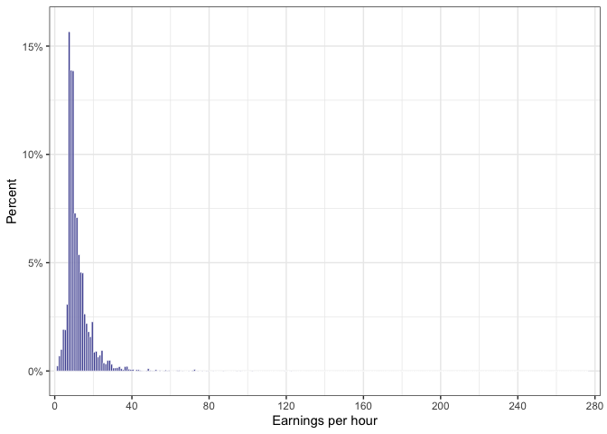
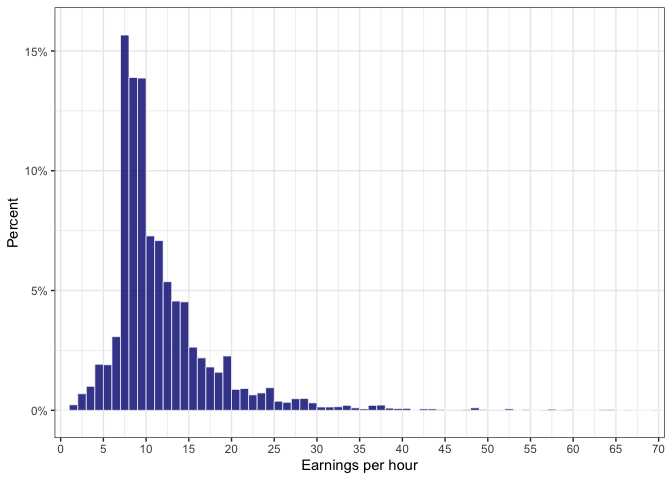
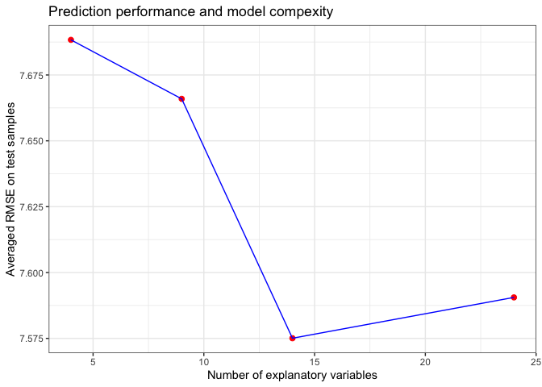

# Dataset

I import the csv data


```r
cps <- read_csv("morg-2014-emp.csv", 
                     col_types = cols(.default = "?"))
```

```
## New names:
## • `` -> `...1`
```

# Select occupation 

I retain 1 occupation type
- Food Preparation and Serving Related Occupations


```r
cps <- cps %>% mutate(sample=ifelse(cps$occ2012>=4000 & cps$occ2012<=4150,1,0))

cps <- cps %>% filter(sample==1)

glimpse(cps)
```

```
## Rows: 8,694
## Columns: 24
## $ ...1     <dbl> 70, 162, 200, 279, 288, 300, 455, 463, 482, 524, 527, 535, 53…
## $ hhid     <dbl> 5.139031e+13, 3.847071e+13, 7.709191e+14, 9.810899e+14, 2.437…
## $ intmonth <chr> "January", "January", "January", "January", "January", "Janua…
## $ stfips   <chr> "AL", "AL", "AL", "AL", "AK", "AK", "AK", "AK", "AK", "AK", "…
## $ weight   <dbl> 2961.1490, 2671.0752, 2416.8545, 2691.4451, 456.4788, 480.955…
## $ earnwke  <dbl> 213.90, 340.00, 270.00, 1691.20, 145.00, 400.00, 323.07, 360.…
## $ uhours   <dbl> 30, 40, 36, 40, 20, 40, 30, 40, 40, 20, 30, 40, 20, 34, 15, 3…
## $ grade92  <dbl> 40, 39, 39, 43, 35, 40, 39, 38, 39, 39, 40, 40, 39, 39, 37, 3…
## $ race     <dbl> 1, 1, 2, 2, 1, 7, 4, 4, 2, 4, 1, 4, 4, 1, 1, 2, 1, 1, 3, 1, 1…
## $ ethnic   <dbl> NA, NA, NA, NA, NA, NA, NA, NA, NA, NA, NA, NA, NA, 1, 1, NA,…
## $ age      <dbl> 32, 36, 43, 56, 16, 32, 59, 33, 41, 17, 29, 48, 58, 21, 16, 4…
## $ sex      <dbl> 2, 2, 2, 2, 2, 1, 1, 1, 1, 2, 2, 1, 2, 1, 2, 1, 1, 1, 2, 2, 2…
## $ marital  <dbl> 5, 1, 7, 7, 7, 7, 3, 7, 1, 7, 7, 1, 1, 7, 7, 1, 7, 1, 7, 1, 1…
## $ ownchild <dbl> 1, 4, 1, 1, 0, 1, 0, 0, 1, 0, 1, 0, 0, 0, 0, 1, 0, 0, 0, 0, 0…
## $ chldpres <dbl> 3, 10, 4, 4, 0, 1, 0, 0, 4, 0, 3, 0, 0, 0, 0, 4, 0, 0, 0, 0, …
## $ prcitshp <chr> "Native, Born In US", "Native, Born In US", "Native, Born In …
## $ state    <chr> "63", "63", "63", "63", "94", "94", "94", "94", "94", "94", "…
## $ ind02    <chr> "Restaurants and other food services (722 exc. 7224)", "Groce…
## $ occ2012  <dbl> 4040, 4020, 4020, 4120, 4060, 4040, 4020, 4020, 4020, 4030, 4…
## $ class    <chr> "Private, For Profit", "Private, For Profit", "Private, For P…
## $ unionmme <chr> "No", "No", "No", "Yes", "No", "No", "No", "No", "No", "No", …
## $ unioncov <chr> "No", "No", "No", NA, "No", "No", "No", "No", "No", "No", "No…
## $ lfsr94   <chr> "Employed-At Work", "Employed-At Work", "Employed-At Work", "…
## $ sample   <dbl> 1, 1, 1, 1, 1, 1, 1, 1, 1, 1, 1, 1, 1, 1, 1, 1, 1, 1, 1, 1, 1…
```

# Create variables 

I generate the target variable and re-specify some predictors 


```r
# Earnings per hour (level and log), female, and age squared
cps <- cps %>% mutate(earnhours=earnwke/uhours, 
                      lnw=log(earnhours+1), # to avoid negative values
                      female=as.numeric(sex==2),
                      agesq=age^2
)

# Race 
cps <- cps %>% mutate(white=as.numeric(race==1),
                      afram = as.numeric(race==2),
                      asian = as.numeric(race==4),
                      hisp = ifelse(!is.na(ethnic),1,0),
                      othernonw = as.numeric(white==0 & afram==0 & asian==0 & hisp==0),
                      nonUSborn = as.numeric(prcitshp=="Foreign Born, US Cit By Naturalization" | prcitshp=="Foreign Born, Not a US Citizen") 
)

# Education
cps <- cps %>% mutate(ed_lessBA=as.numeric(grade92<43),
                      ed_BA=as.numeric(grade92==43),
                      ed_MA=as.numeric(grade92==44),
                      ed_Profess = as.numeric(grade92==45),
                      ed_PhD = as.numeric(grade92==46)
)

# Marital status and children
cps <- cps %>% mutate(married = as.numeric(marital==1 | marital==2),
                      divorced = as.numeric(marital==3 | marital==5 | marital==6),
                      wirowed = as.numeric(marital==4),
                      nevermar = as.numeric(marital==7),
                      
                      child0 = as.numeric(chldpres==0),
                      child1 = as.numeric(chldpres==1),
                      child2 = as.numeric(chldpres==2),
                      child3 = as.numeric(chldpres==3),
                      child4pl = as.numeric(chldpres>=4)
)

# Work-related variables
cps <- cps %>% mutate(fedgov = as.numeric(class=="Government - Federal"),
                      stagov = as.numeric(class=="Government - State"),
                      locgov = as.numeric(class=="Government - Local"),
                      nonprof = as.numeric(class=="Private, Nonprofit"),
                      union = as.numeric(unionmme=="Yes" | unioncov=="Yes")
)
```

# Data summary

I look at some summary statistics for earnings per hour and predictors. I retain only values of earnings per hour equal or above 1$.


```r
cps %>% dplyr::select(earnwke,uhours,earnhours) %>% summary()
```

```
##     earnwke            uhours        earnhours       
##  Min.   :   0.73   Min.   : 1.00   Min.   :  0.0146  
##  1st Qu.: 200.00   1st Qu.:21.00   1st Qu.:  8.1125  
##  Median : 328.25   Median :35.00   Median : 10.0000  
##  Mean   : 390.44   Mean   :31.29   Mean   : 12.1201  
##  3rd Qu.: 480.00   3rd Qu.:40.00   3rd Qu.: 13.8460  
##  Max.   :2884.61   Max.   :99.00   Max.   :276.9200
```

```r
cps %>% filter(earnhours>=1) %>% dplyr::select(earnwke,uhours,earnhours) %>% summary()
```

```
##     earnwke            uhours        earnhours      
##  Min.   :   8.25   Min.   : 1.00   Min.   :  1.075  
##  1st Qu.: 200.00   1st Qu.:21.00   1st Qu.:  8.130  
##  Median : 329.70   Median :35.00   Median : 10.000  
##  Mean   : 391.01   Mean   :31.29   Mean   : 12.138  
##  3rd Qu.: 480.00   3rd Qu.:40.00   3rd Qu.: 13.857  
##  Max.   :2884.61   Max.   :99.00   Max.   :276.920
```

```r
cps <- cps %>% filter(earnhours>=1)

datasummary(earnhours + lnw + female + age + white + afram + asian + hisp + othernonw + nonUSborn + ed_lessBA + ed_BA + ed_MA + ed_Profess + ed_PhD + married + divorced + wirowed + nevermar + child0 + child1 + child2 + child3 + child4pl + fedgov + stagov + locgov + nonprof + union ~
               Mean + Median + Min + Max + P25 + P75 + N, data = cps)
```

<table class="table" style="width: auto !important; margin-left: auto; margin-right: auto;">
 <thead>
  <tr>
   <th style="text-align:left;">   </th>
   <th style="text-align:right;"> Mean </th>
   <th style="text-align:right;"> Median </th>
   <th style="text-align:right;"> Min </th>
   <th style="text-align:right;"> Max </th>
   <th style="text-align:right;">  P25 </th>
   <th style="text-align:right;">  P75 </th>
   <th style="text-align:right;"> N </th>
  </tr>
 </thead>
<tbody>
  <tr>
   <td style="text-align:left;"> earnhours </td>
   <td style="text-align:right;"> 12.14 </td>
   <td style="text-align:right;"> 10.00 </td>
   <td style="text-align:right;"> 1.07 </td>
   <td style="text-align:right;"> 276.92 </td>
   <td style="text-align:right;"> 8.13 </td>
   <td style="text-align:right;"> 13.86 </td>
   <td style="text-align:right;"> 8681 </td>
  </tr>
  <tr>
   <td style="text-align:left;"> lnw </td>
   <td style="text-align:right;"> 2.48 </td>
   <td style="text-align:right;"> 2.40 </td>
   <td style="text-align:right;"> 0.73 </td>
   <td style="text-align:right;"> 5.63 </td>
   <td style="text-align:right;"> 2.21 </td>
   <td style="text-align:right;"> 2.70 </td>
   <td style="text-align:right;"> 8681 </td>
  </tr>
  <tr>
   <td style="text-align:left;"> female </td>
   <td style="text-align:right;"> 0.56 </td>
   <td style="text-align:right;"> 1.00 </td>
   <td style="text-align:right;"> 0.00 </td>
   <td style="text-align:right;"> 1.00 </td>
   <td style="text-align:right;"> 0.00 </td>
   <td style="text-align:right;"> 1.00 </td>
   <td style="text-align:right;"> 8681 </td>
  </tr>
  <tr>
   <td style="text-align:left;"> age </td>
   <td style="text-align:right;"> 32.60 </td>
   <td style="text-align:right;"> 29.00 </td>
   <td style="text-align:right;"> 16.00 </td>
   <td style="text-align:right;"> 64.00 </td>
   <td style="text-align:right;"> 21.00 </td>
   <td style="text-align:right;"> 43.00 </td>
   <td style="text-align:right;"> 8681 </td>
  </tr>
  <tr>
   <td style="text-align:left;"> white </td>
   <td style="text-align:right;"> 0.79 </td>
   <td style="text-align:right;"> 1.00 </td>
   <td style="text-align:right;"> 0.00 </td>
   <td style="text-align:right;"> 1.00 </td>
   <td style="text-align:right;"> 1.00 </td>
   <td style="text-align:right;"> 1.00 </td>
   <td style="text-align:right;"> 8681 </td>
  </tr>
  <tr>
   <td style="text-align:left;"> afram </td>
   <td style="text-align:right;"> 0.11 </td>
   <td style="text-align:right;"> 0.00 </td>
   <td style="text-align:right;"> 0.00 </td>
   <td style="text-align:right;"> 1.00 </td>
   <td style="text-align:right;"> 0.00 </td>
   <td style="text-align:right;"> 0.00 </td>
   <td style="text-align:right;"> 8681 </td>
  </tr>
  <tr>
   <td style="text-align:left;"> asian </td>
   <td style="text-align:right;"> 0.06 </td>
   <td style="text-align:right;"> 0.00 </td>
   <td style="text-align:right;"> 0.00 </td>
   <td style="text-align:right;"> 1.00 </td>
   <td style="text-align:right;"> 0.00 </td>
   <td style="text-align:right;"> 0.00 </td>
   <td style="text-align:right;"> 8681 </td>
  </tr>
  <tr>
   <td style="text-align:left;"> hisp </td>
   <td style="text-align:right;"> 0.22 </td>
   <td style="text-align:right;"> 0.00 </td>
   <td style="text-align:right;"> 0.00 </td>
   <td style="text-align:right;"> 1.00 </td>
   <td style="text-align:right;"> 0.00 </td>
   <td style="text-align:right;"> 0.00 </td>
   <td style="text-align:right;"> 8681 </td>
  </tr>
  <tr>
   <td style="text-align:left;"> othernonw </td>
   <td style="text-align:right;"> 0.03 </td>
   <td style="text-align:right;"> 0.00 </td>
   <td style="text-align:right;"> 0.00 </td>
   <td style="text-align:right;"> 1.00 </td>
   <td style="text-align:right;"> 0.00 </td>
   <td style="text-align:right;"> 0.00 </td>
   <td style="text-align:right;"> 8681 </td>
  </tr>
  <tr>
   <td style="text-align:left;"> nonUSborn </td>
   <td style="text-align:right;"> 0.20 </td>
   <td style="text-align:right;"> 0.00 </td>
   <td style="text-align:right;"> 0.00 </td>
   <td style="text-align:right;"> 1.00 </td>
   <td style="text-align:right;"> 0.00 </td>
   <td style="text-align:right;"> 0.00 </td>
   <td style="text-align:right;"> 8681 </td>
  </tr>
  <tr>
   <td style="text-align:left;"> ed_lessBA </td>
   <td style="text-align:right;"> 0.90 </td>
   <td style="text-align:right;"> 1.00 </td>
   <td style="text-align:right;"> 0.00 </td>
   <td style="text-align:right;"> 1.00 </td>
   <td style="text-align:right;"> 1.00 </td>
   <td style="text-align:right;"> 1.00 </td>
   <td style="text-align:right;"> 8681 </td>
  </tr>
  <tr>
   <td style="text-align:left;"> ed_BA </td>
   <td style="text-align:right;"> 0.09 </td>
   <td style="text-align:right;"> 0.00 </td>
   <td style="text-align:right;"> 0.00 </td>
   <td style="text-align:right;"> 1.00 </td>
   <td style="text-align:right;"> 0.00 </td>
   <td style="text-align:right;"> 0.00 </td>
   <td style="text-align:right;"> 8681 </td>
  </tr>
  <tr>
   <td style="text-align:left;"> ed_MA </td>
   <td style="text-align:right;"> 0.01 </td>
   <td style="text-align:right;"> 0.00 </td>
   <td style="text-align:right;"> 0.00 </td>
   <td style="text-align:right;"> 1.00 </td>
   <td style="text-align:right;"> 0.00 </td>
   <td style="text-align:right;"> 0.00 </td>
   <td style="text-align:right;"> 8681 </td>
  </tr>
  <tr>
   <td style="text-align:left;"> ed_Profess </td>
   <td style="text-align:right;"> 0.00 </td>
   <td style="text-align:right;"> 0.00 </td>
   <td style="text-align:right;"> 0.00 </td>
   <td style="text-align:right;"> 1.00 </td>
   <td style="text-align:right;"> 0.00 </td>
   <td style="text-align:right;"> 0.00 </td>
   <td style="text-align:right;"> 8681 </td>
  </tr>
  <tr>
   <td style="text-align:left;"> ed_PhD </td>
   <td style="text-align:right;"> 0.00 </td>
   <td style="text-align:right;"> 0.00 </td>
   <td style="text-align:right;"> 0.00 </td>
   <td style="text-align:right;"> 1.00 </td>
   <td style="text-align:right;"> 0.00 </td>
   <td style="text-align:right;"> 0.00 </td>
   <td style="text-align:right;"> 8681 </td>
  </tr>
  <tr>
   <td style="text-align:left;"> married </td>
   <td style="text-align:right;"> 0.27 </td>
   <td style="text-align:right;"> 0.00 </td>
   <td style="text-align:right;"> 0.00 </td>
   <td style="text-align:right;"> 1.00 </td>
   <td style="text-align:right;"> 0.00 </td>
   <td style="text-align:right;"> 1.00 </td>
   <td style="text-align:right;"> 8681 </td>
  </tr>
  <tr>
   <td style="text-align:left;"> divorced </td>
   <td style="text-align:right;"> 0.12 </td>
   <td style="text-align:right;"> 0.00 </td>
   <td style="text-align:right;"> 0.00 </td>
   <td style="text-align:right;"> 1.00 </td>
   <td style="text-align:right;"> 0.00 </td>
   <td style="text-align:right;"> 0.00 </td>
   <td style="text-align:right;"> 8681 </td>
  </tr>
  <tr>
   <td style="text-align:left;"> wirowed </td>
   <td style="text-align:right;"> 0.01 </td>
   <td style="text-align:right;"> 0.00 </td>
   <td style="text-align:right;"> 0.00 </td>
   <td style="text-align:right;"> 1.00 </td>
   <td style="text-align:right;"> 0.00 </td>
   <td style="text-align:right;"> 0.00 </td>
   <td style="text-align:right;"> 8681 </td>
  </tr>
  <tr>
   <td style="text-align:left;"> nevermar </td>
   <td style="text-align:right;"> 0.59 </td>
   <td style="text-align:right;"> 1.00 </td>
   <td style="text-align:right;"> 0.00 </td>
   <td style="text-align:right;"> 1.00 </td>
   <td style="text-align:right;"> 0.00 </td>
   <td style="text-align:right;"> 1.00 </td>
   <td style="text-align:right;"> 8681 </td>
  </tr>
  <tr>
   <td style="text-align:left;"> child0 </td>
   <td style="text-align:right;"> 0.75 </td>
   <td style="text-align:right;"> 1.00 </td>
   <td style="text-align:right;"> 0.00 </td>
   <td style="text-align:right;"> 1.00 </td>
   <td style="text-align:right;"> 0.00 </td>
   <td style="text-align:right;"> 1.00 </td>
   <td style="text-align:right;"> 8681 </td>
  </tr>
  <tr>
   <td style="text-align:left;"> child1 </td>
   <td style="text-align:right;"> 0.04 </td>
   <td style="text-align:right;"> 0.00 </td>
   <td style="text-align:right;"> 0.00 </td>
   <td style="text-align:right;"> 1.00 </td>
   <td style="text-align:right;"> 0.00 </td>
   <td style="text-align:right;"> 0.00 </td>
   <td style="text-align:right;"> 8681 </td>
  </tr>
  <tr>
   <td style="text-align:left;"> child2 </td>
   <td style="text-align:right;"> 0.02 </td>
   <td style="text-align:right;"> 0.00 </td>
   <td style="text-align:right;"> 0.00 </td>
   <td style="text-align:right;"> 1.00 </td>
   <td style="text-align:right;"> 0.00 </td>
   <td style="text-align:right;"> 0.00 </td>
   <td style="text-align:right;"> 8681 </td>
  </tr>
  <tr>
   <td style="text-align:left;"> child3 </td>
   <td style="text-align:right;"> 0.06 </td>
   <td style="text-align:right;"> 0.00 </td>
   <td style="text-align:right;"> 0.00 </td>
   <td style="text-align:right;"> 1.00 </td>
   <td style="text-align:right;"> 0.00 </td>
   <td style="text-align:right;"> 0.00 </td>
   <td style="text-align:right;"> 8681 </td>
  </tr>
  <tr>
   <td style="text-align:left;"> child4pl </td>
   <td style="text-align:right;"> 0.13 </td>
   <td style="text-align:right;"> 0.00 </td>
   <td style="text-align:right;"> 0.00 </td>
   <td style="text-align:right;"> 1.00 </td>
   <td style="text-align:right;"> 0.00 </td>
   <td style="text-align:right;"> 0.00 </td>
   <td style="text-align:right;"> 8681 </td>
  </tr>
  <tr>
   <td style="text-align:left;"> fedgov </td>
   <td style="text-align:right;"> 0.01 </td>
   <td style="text-align:right;"> 0.00 </td>
   <td style="text-align:right;"> 0.00 </td>
   <td style="text-align:right;"> 1.00 </td>
   <td style="text-align:right;"> 0.00 </td>
   <td style="text-align:right;"> 0.00 </td>
   <td style="text-align:right;"> 8681 </td>
  </tr>
  <tr>
   <td style="text-align:left;"> stagov </td>
   <td style="text-align:right;"> 0.02 </td>
   <td style="text-align:right;"> 0.00 </td>
   <td style="text-align:right;"> 0.00 </td>
   <td style="text-align:right;"> 1.00 </td>
   <td style="text-align:right;"> 0.00 </td>
   <td style="text-align:right;"> 0.00 </td>
   <td style="text-align:right;"> 8681 </td>
  </tr>
  <tr>
   <td style="text-align:left;"> locgov </td>
   <td style="text-align:right;"> 0.03 </td>
   <td style="text-align:right;"> 0.00 </td>
   <td style="text-align:right;"> 0.00 </td>
   <td style="text-align:right;"> 1.00 </td>
   <td style="text-align:right;"> 0.00 </td>
   <td style="text-align:right;"> 0.00 </td>
   <td style="text-align:right;"> 8681 </td>
  </tr>
  <tr>
   <td style="text-align:left;"> nonprof </td>
   <td style="text-align:right;"> 0.02 </td>
   <td style="text-align:right;"> 0.00 </td>
   <td style="text-align:right;"> 0.00 </td>
   <td style="text-align:right;"> 1.00 </td>
   <td style="text-align:right;"> 0.00 </td>
   <td style="text-align:right;"> 0.00 </td>
   <td style="text-align:right;"> 8681 </td>
  </tr>
  <tr>
   <td style="text-align:left;"> union </td>
   <td style="text-align:right;"> 0.05 </td>
   <td style="text-align:right;"> 0.00 </td>
   <td style="text-align:right;"> 0.00 </td>
   <td style="text-align:right;"> 1.00 </td>
   <td style="text-align:right;"> 0.00 </td>
   <td style="text-align:right;"> 0.00 </td>
   <td style="text-align:right;"> 8681 </td>
  </tr>
</tbody>
</table>

# Graphical anaylsis of earnings per hour


```r
# for the entire sample 
ggplot(data=cps, aes(x=earnhours)) +
  geom_histogram(aes(y = (after_stat(count))/sum(after_stat(count))), binwidth = 1, boundary=0,
                 fill = 'navyblue', color = 'white', size = 0.25, alpha = 0.8,  show.legend=F, na.rm=TRUE) +
  coord_cartesian(xlim = c(0, 280)) +
  labs(x = 'Earnings per hour',y = 'Percent')+
  theme_bw() +
  expand_limits(x = 0.01, y = 0.01) +
  scale_y_continuous(expand = c(0.01,0.01),labels = scales::percent_format(accuracy = 1)) +
  scale_x_continuous(expand = c(0.01,0.01),breaks = seq(0,280, 40))
```

```
## Warning: Using `size` aesthetic for lines was deprecated in ggplot2 3.4.0.
## ℹ Please use `linewidth` instead.
```

<!-- -->

```r
# Should the extreme values be excluded?

# looking closer to those earnings per hour below 70
ggplot(data=cps, aes(x=earnhours)) +
  geom_histogram(aes(y = (..count..)/sum(..count..)), binwidth = 1, boundary=0,
                 fill = 'navyblue', color = 'white', size = 0.25, alpha = 0.8,  show.legend=F, na.rm=TRUE) +
  coord_cartesian(xlim = c(0, 70)) +
  labs(x = 'Earnings per hour',y = 'Percent')+
  theme_bw() +
  expand_limits(x = 0.01, y = 0.01) +
  scale_y_continuous(expand = c(0.01,0.01),labels = scales::percent_format(accuracy = 1)) +
  scale_x_continuous(expand = c(0.01,0.01),breaks = seq(0,70, 5))
```

```
## Warning: The dot-dot notation (`..count..`) was deprecated in ggplot2 3.4.0.
## ℹ Please use `after_stat(count)` instead.
```

<!-- -->

# Models and estimations

Target: earnings per hour

First level regressions
Predictors:
1. female, age, age^2
2. female, age, age^2, race
3. female, age, age^2, race, union, educ
4. female, age, age^2, race x age, union x age, educ x age


```r
model1 <- as.formula(earnhours ~ female + age + agesq)
model2 <- as.formula(earnhours ~ female + age + agesq + afram + asian + hisp + othernonw + nonUSborn)
model3 <- as.formula(earnhours ~ female + age + agesq + afram + asian + hisp + othernonw + nonUSborn + union + ed_BA + ed_MA + ed_Profess + ed_PhD)
model4 <- as.formula(earnhours ~ female + age + agesq + afram*age + asian*age + hisp*age + othernonw*age + nonUSborn*age + union*age + ed_BA*age + ed_MA*age + ed_Profess*age + ed_PhD*age)

# OLS
reg1 <- feols(model1, data=cps, vcov = 'hetero')
reg2 <- feols(model2, data=cps, vcov = 'hetero')
reg3 <- feols(model3, data=cps, vcov = 'hetero')
reg4 <- feols(model4, data=cps, vcov = 'hetero')
```

# Evaluate models

Look at BIC and RMSE in the full sample


```r
fitstat_register('k', function(x){length(x$coefficients) - 1}, 'No. Variables')
etable(reg1, reg2, reg3, reg4, fitstat = c('bic','rmse','r2','n','k'))
```

```{=html}
<table class="huxtable" style="border-collapse: collapse; border: 0px; margin-bottom: 2em; margin-top: 2em; ; margin-left: auto; margin-right: auto;  " id="tab:evaluating">
<col><col><col><col><col><tr>
<th style="vertical-align: top; text-align: left; white-space: normal; border-style: solid solid solid solid; border-width: 0.4pt 0pt 0.4pt 0.4pt;    padding: 6pt 6pt 6pt 6pt; font-weight: bold;"></th><th style="vertical-align: top; text-align: left; white-space: normal; border-style: solid solid solid solid; border-width: 0.4pt 0pt 0.4pt 0pt;    padding: 6pt 6pt 6pt 6pt; font-weight: bold;">reg1</th><th style="vertical-align: top; text-align: left; white-space: normal; border-style: solid solid solid solid; border-width: 0.4pt 0pt 0.4pt 0pt;    padding: 6pt 6pt 6pt 6pt; font-weight: bold;">reg2</th><th style="vertical-align: top; text-align: left; white-space: normal; border-style: solid solid solid solid; border-width: 0.4pt 0pt 0.4pt 0pt;    padding: 6pt 6pt 6pt 6pt; font-weight: bold;">reg3</th><th style="vertical-align: top; text-align: left; white-space: normal; border-style: solid solid solid solid; border-width: 0.4pt 0.4pt 0.4pt 0pt;    padding: 6pt 6pt 6pt 6pt; font-weight: bold;">reg4</th></tr>
<tr>
<td style="vertical-align: top; text-align: left; white-space: normal; border-style: solid solid solid solid; border-width: 0.4pt 0pt 0pt 0.4pt;    padding: 6pt 6pt 6pt 6pt; background-color: rgb(242, 242, 242); font-weight: normal;">Dependent Var.:</td><td style="vertical-align: top; text-align: left; white-space: normal; border-style: solid solid solid solid; border-width: 0.4pt 0pt 0pt 0pt;    padding: 6pt 6pt 6pt 6pt; background-color: rgb(242, 242, 242); font-weight: normal;">earnhours</td><td style="vertical-align: top; text-align: left; white-space: normal; border-style: solid solid solid solid; border-width: 0.4pt 0pt 0pt 0pt;    padding: 6pt 6pt 6pt 6pt; background-color: rgb(242, 242, 242); font-weight: normal;">earnhours</td><td style="vertical-align: top; text-align: left; white-space: normal; border-style: solid solid solid solid; border-width: 0.4pt 0pt 0pt 0pt;    padding: 6pt 6pt 6pt 6pt; background-color: rgb(242, 242, 242); font-weight: normal;">earnhours</td><td style="vertical-align: top; text-align: left; white-space: normal; border-style: solid solid solid solid; border-width: 0.4pt 0.4pt 0pt 0pt;    padding: 6pt 6pt 6pt 6pt; background-color: rgb(242, 242, 242); font-weight: normal;">earnhours</td></tr>
<tr>
<td style="vertical-align: top; text-align: left; white-space: normal; border-style: solid solid solid solid; border-width: 0pt 0pt 0pt 0.4pt;    padding: 6pt 6pt 6pt 6pt; font-weight: normal;"> </td><td style="vertical-align: top; text-align: left; white-space: normal; border-style: solid solid solid solid; border-width: 0pt 0pt 0pt 0pt;    padding: 6pt 6pt 6pt 6pt; font-weight: normal;"> </td><td style="vertical-align: top; text-align: left; white-space: normal; border-style: solid solid solid solid; border-width: 0pt 0pt 0pt 0pt;    padding: 6pt 6pt 6pt 6pt; font-weight: normal;"> </td><td style="vertical-align: top; text-align: left; white-space: normal; border-style: solid solid solid solid; border-width: 0pt 0pt 0pt 0pt;    padding: 6pt 6pt 6pt 6pt; font-weight: normal;"> </td><td style="vertical-align: top; text-align: left; white-space: normal; border-style: solid solid solid solid; border-width: 0pt 0.4pt 0pt 0pt;    padding: 6pt 6pt 6pt 6pt; font-weight: normal;"> </td></tr>
<tr>
<td style="vertical-align: top; text-align: left; white-space: normal; border-style: solid solid solid solid; border-width: 0pt 0pt 0pt 0.4pt;    padding: 6pt 6pt 6pt 6pt; background-color: rgb(242, 242, 242); font-weight: normal;">Constant</td><td style="vertical-align: top; text-align: left; white-space: normal; border-style: solid solid solid solid; border-width: 0pt 0pt 0pt 0pt;    padding: 6pt 6pt 6pt 6pt; background-color: rgb(242, 242, 242); font-weight: normal;">3.482*** (0.6634)</td><td style="vertical-align: top; text-align: left; white-space: normal; border-style: solid solid solid solid; border-width: 0pt 0pt 0pt 0pt;    padding: 6pt 6pt 6pt 6pt; background-color: rgb(242, 242, 242); font-weight: normal;">2.967*** (0.6707)</td><td style="vertical-align: top; text-align: left; white-space: normal; border-style: solid solid solid solid; border-width: 0pt 0pt 0pt 0pt;    padding: 6pt 6pt 6pt 6pt; background-color: rgb(242, 242, 242); font-weight: normal;">4.005*** (0.6669)</td><td style="vertical-align: top; text-align: left; white-space: normal; border-style: solid solid solid solid; border-width: 0pt 0.4pt 0pt 0pt;    padding: 6pt 6pt 6pt 6pt; background-color: rgb(242, 242, 242); font-weight: normal;">3.454*** (0.6389)</td></tr>
<tr>
<td style="vertical-align: top; text-align: left; white-space: normal; border-style: solid solid solid solid; border-width: 0pt 0pt 0pt 0.4pt;    padding: 6pt 6pt 6pt 6pt; font-weight: normal;">female</td><td style="vertical-align: top; text-align: left; white-space: normal; border-style: solid solid solid solid; border-width: 0pt 0pt 0pt 0pt;    padding: 6pt 6pt 6pt 6pt; font-weight: normal;">-1.070*** (0.1699)</td><td style="vertical-align: top; text-align: left; white-space: normal; border-style: solid solid solid solid; border-width: 0pt 0pt 0pt 0pt;    padding: 6pt 6pt 6pt 6pt; font-weight: normal;">-1.162*** (0.1731)</td><td style="vertical-align: top; text-align: left; white-space: normal; border-style: solid solid solid solid; border-width: 0pt 0pt 0pt 0pt;    padding: 6pt 6pt 6pt 6pt; font-weight: normal;">-1.126*** (0.1699)</td><td style="vertical-align: top; text-align: left; white-space: normal; border-style: solid solid solid solid; border-width: 0pt 0.4pt 0pt 0pt;    padding: 6pt 6pt 6pt 6pt; font-weight: normal;">-1.130*** (0.1695)</td></tr>
<tr>
<td style="vertical-align: top; text-align: left; white-space: normal; border-style: solid solid solid solid; border-width: 0pt 0pt 0pt 0.4pt;    padding: 6pt 6pt 6pt 6pt; background-color: rgb(242, 242, 242); font-weight: normal;">age</td><td style="vertical-align: top; text-align: left; white-space: normal; border-style: solid solid solid solid; border-width: 0pt 0pt 0pt 0pt;    padding: 6pt 6pt 6pt 6pt; background-color: rgb(242, 242, 242); font-weight: normal;">0.4812*** (0.0398)</td><td style="vertical-align: top; text-align: left; white-space: normal; border-style: solid solid solid solid; border-width: 0pt 0pt 0pt 0pt;    padding: 6pt 6pt 6pt 6pt; background-color: rgb(242, 242, 242); font-weight: normal;">0.5305*** (0.0418)</td><td style="vertical-align: top; text-align: left; white-space: normal; border-style: solid solid solid solid; border-width: 0pt 0pt 0pt 0pt;    padding: 6pt 6pt 6pt 6pt; background-color: rgb(242, 242, 242); font-weight: normal;">0.4385*** (0.0415)</td><td style="vertical-align: top; text-align: left; white-space: normal; border-style: solid solid solid solid; border-width: 0pt 0.4pt 0pt 0pt;    padding: 6pt 6pt 6pt 6pt; background-color: rgb(242, 242, 242); font-weight: normal;">0.4734*** (0.0387)</td></tr>
<tr>
<td style="vertical-align: top; text-align: left; white-space: normal; border-style: solid solid solid solid; border-width: 0pt 0pt 0pt 0.4pt;    padding: 6pt 6pt 6pt 6pt; font-weight: normal;">agesq</td><td style="vertical-align: top; text-align: left; white-space: normal; border-style: solid solid solid solid; border-width: 0pt 0pt 0pt 0pt;    padding: 6pt 6pt 6pt 6pt; font-weight: normal;">-0.0052*** (0.0005)</td><td style="vertical-align: top; text-align: left; white-space: normal; border-style: solid solid solid solid; border-width: 0pt 0pt 0pt 0pt;    padding: 6pt 6pt 6pt 6pt; font-weight: normal;">-0.0058*** (0.0006)</td><td style="vertical-align: top; text-align: left; white-space: normal; border-style: solid solid solid solid; border-width: 0pt 0pt 0pt 0pt;    padding: 6pt 6pt 6pt 6pt; font-weight: normal;">-0.0047*** (0.0006)</td><td style="vertical-align: top; text-align: left; white-space: normal; border-style: solid solid solid solid; border-width: 0pt 0.4pt 0pt 0pt;    padding: 6pt 6pt 6pt 6pt; font-weight: normal;">-0.0052*** (0.0005)</td></tr>
<tr>
<td style="vertical-align: top; text-align: left; white-space: normal; border-style: solid solid solid solid; border-width: 0pt 0pt 0pt 0.4pt;    padding: 6pt 6pt 6pt 6pt; background-color: rgb(242, 242, 242); font-weight: normal;">afram</td><td style="vertical-align: top; text-align: left; white-space: normal; border-style: solid solid solid solid; border-width: 0pt 0pt 0pt 0pt;    padding: 6pt 6pt 6pt 6pt; background-color: rgb(242, 242, 242); font-weight: normal;">  </td><td style="vertical-align: top; text-align: left; white-space: normal; border-style: solid solid solid solid; border-width: 0pt 0pt 0pt 0pt;    padding: 6pt 6pt 6pt 6pt; background-color: rgb(242, 242, 242); font-weight: normal;">-1.073*** (0.2060)</td><td style="vertical-align: top; text-align: left; white-space: normal; border-style: solid solid solid solid; border-width: 0pt 0pt 0pt 0pt;    padding: 6pt 6pt 6pt 6pt; background-color: rgb(242, 242, 242); font-weight: normal;">-0.8249*** (0.2020)</td><td style="vertical-align: top; text-align: left; white-space: normal; border-style: solid solid solid solid; border-width: 0pt 0.4pt 0pt 0pt;    padding: 6pt 6pt 6pt 6pt; background-color: rgb(242, 242, 242); font-weight: normal;">-1.431** (0.4761)</td></tr>
<tr>
<td style="vertical-align: top; text-align: left; white-space: normal; border-style: solid solid solid solid; border-width: 0pt 0pt 0pt 0.4pt;    padding: 6pt 6pt 6pt 6pt; font-weight: normal;">asian</td><td style="vertical-align: top; text-align: left; white-space: normal; border-style: solid solid solid solid; border-width: 0pt 0pt 0pt 0pt;    padding: 6pt 6pt 6pt 6pt; font-weight: normal;">  </td><td style="vertical-align: top; text-align: left; white-space: normal; border-style: solid solid solid solid; border-width: 0pt 0pt 0pt 0pt;    padding: 6pt 6pt 6pt 6pt; font-weight: normal;">1.298** (0.4317)</td><td style="vertical-align: top; text-align: left; white-space: normal; border-style: solid solid solid solid; border-width: 0pt 0pt 0pt 0pt;    padding: 6pt 6pt 6pt 6pt; font-weight: normal;">1.066* (0.4313)</td><td style="vertical-align: top; text-align: left; white-space: normal; border-style: solid solid solid solid; border-width: 0pt 0.4pt 0pt 0pt;    padding: 6pt 6pt 6pt 6pt; font-weight: normal;">1.040 (1.120)</td></tr>
<tr>
<td style="vertical-align: top; text-align: left; white-space: normal; border-style: solid solid solid solid; border-width: 0pt 0pt 0pt 0.4pt;    padding: 6pt 6pt 6pt 6pt; background-color: rgb(242, 242, 242); font-weight: normal;">hisp</td><td style="vertical-align: top; text-align: left; white-space: normal; border-style: solid solid solid solid; border-width: 0pt 0pt 0pt 0pt;    padding: 6pt 6pt 6pt 6pt; background-color: rgb(242, 242, 242); font-weight: normal;">  </td><td style="vertical-align: top; text-align: left; white-space: normal; border-style: solid solid solid solid; border-width: 0pt 0pt 0pt 0pt;    padding: 6pt 6pt 6pt 6pt; background-color: rgb(242, 242, 242); font-weight: normal;">-0.3339 (0.3204)</td><td style="vertical-align: top; text-align: left; white-space: normal; border-style: solid solid solid solid; border-width: 0pt 0pt 0pt 0pt;    padding: 6pt 6pt 6pt 6pt; background-color: rgb(242, 242, 242); font-weight: normal;">0.0008 (0.3187)</td><td style="vertical-align: top; text-align: left; white-space: normal; border-style: solid solid solid solid; border-width: 0pt 0.4pt 0pt 0pt;    padding: 6pt 6pt 6pt 6pt; background-color: rgb(242, 242, 242); font-weight: normal;">1.908* (0.9292)</td></tr>
<tr>
<td style="vertical-align: top; text-align: left; white-space: normal; border-style: solid solid solid solid; border-width: 0pt 0pt 0pt 0.4pt;    padding: 6pt 6pt 6pt 6pt; font-weight: normal;">othernonw</td><td style="vertical-align: top; text-align: left; white-space: normal; border-style: solid solid solid solid; border-width: 0pt 0pt 0pt 0pt;    padding: 6pt 6pt 6pt 6pt; font-weight: normal;">  </td><td style="vertical-align: top; text-align: left; white-space: normal; border-style: solid solid solid solid; border-width: 0pt 0pt 0pt 0pt;    padding: 6pt 6pt 6pt 6pt; font-weight: normal;">0.3132 (0.5450)</td><td style="vertical-align: top; text-align: left; white-space: normal; border-style: solid solid solid solid; border-width: 0pt 0pt 0pt 0pt;    padding: 6pt 6pt 6pt 6pt; font-weight: normal;">0.4819 (0.5402)</td><td style="vertical-align: top; text-align: left; white-space: normal; border-style: solid solid solid solid; border-width: 0pt 0.4pt 0pt 0pt;    padding: 6pt 6pt 6pt 6pt; font-weight: normal;">1.417 (1.207)</td></tr>
<tr>
<td style="vertical-align: top; text-align: left; white-space: normal; border-style: solid solid solid solid; border-width: 0pt 0pt 0pt 0.4pt;    padding: 6pt 6pt 6pt 6pt; background-color: rgb(242, 242, 242); font-weight: normal;">nonUSborn</td><td style="vertical-align: top; text-align: left; white-space: normal; border-style: solid solid solid solid; border-width: 0pt 0pt 0pt 0pt;    padding: 6pt 6pt 6pt 6pt; background-color: rgb(242, 242, 242); font-weight: normal;">  </td><td style="vertical-align: top; text-align: left; white-space: normal; border-style: solid solid solid solid; border-width: 0pt 0pt 0pt 0pt;    padding: 6pt 6pt 6pt 6pt; background-color: rgb(242, 242, 242); font-weight: normal;">-1.083*** (0.2859)</td><td style="vertical-align: top; text-align: left; white-space: normal; border-style: solid solid solid solid; border-width: 0pt 0pt 0pt 0pt;    padding: 6pt 6pt 6pt 6pt; background-color: rgb(242, 242, 242); font-weight: normal;">-1.116*** (0.2824)</td><td style="vertical-align: top; text-align: left; white-space: normal; border-style: solid solid solid solid; border-width: 0pt 0.4pt 0pt 0pt;    padding: 6pt 6pt 6pt 6pt; background-color: rgb(242, 242, 242); font-weight: normal;">-1.357 (0.8299)</td></tr>
<tr>
<td style="vertical-align: top; text-align: left; white-space: normal; border-style: solid solid solid solid; border-width: 0pt 0pt 0pt 0.4pt;    padding: 6pt 6pt 6pt 6pt; font-weight: normal;">union</td><td style="vertical-align: top; text-align: left; white-space: normal; border-style: solid solid solid solid; border-width: 0pt 0pt 0pt 0pt;    padding: 6pt 6pt 6pt 6pt; font-weight: normal;">  </td><td style="vertical-align: top; text-align: left; white-space: normal; border-style: solid solid solid solid; border-width: 0pt 0pt 0pt 0pt;    padding: 6pt 6pt 6pt 6pt; font-weight: normal;">  </td><td style="vertical-align: top; text-align: left; white-space: normal; border-style: solid solid solid solid; border-width: 0pt 0pt 0pt 0pt;    padding: 6pt 6pt 6pt 6pt; font-weight: normal;">1.883*** (0.3753)</td><td style="vertical-align: top; text-align: left; white-space: normal; border-style: solid solid solid solid; border-width: 0pt 0.4pt 0pt 0pt;    padding: 6pt 6pt 6pt 6pt; font-weight: normal;">-1.612 (1.083)</td></tr>
<tr>
<td style="vertical-align: top; text-align: left; white-space: normal; border-style: solid solid solid solid; border-width: 0pt 0pt 0pt 0.4pt;    padding: 6pt 6pt 6pt 6pt; background-color: rgb(242, 242, 242); font-weight: normal;">ed_BA</td><td style="vertical-align: top; text-align: left; white-space: normal; border-style: solid solid solid solid; border-width: 0pt 0pt 0pt 0pt;    padding: 6pt 6pt 6pt 6pt; background-color: rgb(242, 242, 242); font-weight: normal;">  </td><td style="vertical-align: top; text-align: left; white-space: normal; border-style: solid solid solid solid; border-width: 0pt 0pt 0pt 0pt;    padding: 6pt 6pt 6pt 6pt; background-color: rgb(242, 242, 242); font-weight: normal;">  </td><td style="vertical-align: top; text-align: left; white-space: normal; border-style: solid solid solid solid; border-width: 0pt 0pt 0pt 0pt;    padding: 6pt 6pt 6pt 6pt; background-color: rgb(242, 242, 242); font-weight: normal;">4.256*** (0.3786)</td><td style="vertical-align: top; text-align: left; white-space: normal; border-style: solid solid solid solid; border-width: 0pt 0.4pt 0pt 0pt;    padding: 6pt 6pt 6pt 6pt; background-color: rgb(242, 242, 242); font-weight: normal;">2.506* (1.240)</td></tr>
<tr>
<td style="vertical-align: top; text-align: left; white-space: normal; border-style: solid solid solid solid; border-width: 0pt 0pt 0pt 0.4pt;    padding: 6pt 6pt 6pt 6pt; font-weight: normal;">ed_MA</td><td style="vertical-align: top; text-align: left; white-space: normal; border-style: solid solid solid solid; border-width: 0pt 0pt 0pt 0pt;    padding: 6pt 6pt 6pt 6pt; font-weight: normal;">  </td><td style="vertical-align: top; text-align: left; white-space: normal; border-style: solid solid solid solid; border-width: 0pt 0pt 0pt 0pt;    padding: 6pt 6pt 6pt 6pt; font-weight: normal;">  </td><td style="vertical-align: top; text-align: left; white-space: normal; border-style: solid solid solid solid; border-width: 0pt 0pt 0pt 0pt;    padding: 6pt 6pt 6pt 6pt; font-weight: normal;">1.879. (1.003)</td><td style="vertical-align: top; text-align: left; white-space: normal; border-style: solid solid solid solid; border-width: 0pt 0.4pt 0pt 0pt;    padding: 6pt 6pt 6pt 6pt; font-weight: normal;">1.577 (3.096)</td></tr>
<tr>
<td style="vertical-align: top; text-align: left; white-space: normal; border-style: solid solid solid solid; border-width: 0pt 0pt 0pt 0.4pt;    padding: 6pt 6pt 6pt 6pt; background-color: rgb(242, 242, 242); font-weight: normal;">ed_Profess</td><td style="vertical-align: top; text-align: left; white-space: normal; border-style: solid solid solid solid; border-width: 0pt 0pt 0pt 0pt;    padding: 6pt 6pt 6pt 6pt; background-color: rgb(242, 242, 242); font-weight: normal;">  </td><td style="vertical-align: top; text-align: left; white-space: normal; border-style: solid solid solid solid; border-width: 0pt 0pt 0pt 0pt;    padding: 6pt 6pt 6pt 6pt; background-color: rgb(242, 242, 242); font-weight: normal;">  </td><td style="vertical-align: top; text-align: left; white-space: normal; border-style: solid solid solid solid; border-width: 0pt 0pt 0pt 0pt;    padding: 6pt 6pt 6pt 6pt; background-color: rgb(242, 242, 242); font-weight: normal;">6.681 (5.696)</td><td style="vertical-align: top; text-align: left; white-space: normal; border-style: solid solid solid solid; border-width: 0pt 0.4pt 0pt 0pt;    padding: 6pt 6pt 6pt 6pt; background-color: rgb(242, 242, 242); font-weight: normal;">8.162 (9.159)</td></tr>
<tr>
<td style="vertical-align: top; text-align: left; white-space: normal; border-style: solid solid solid solid; border-width: 0pt 0pt 0pt 0.4pt;    padding: 6pt 6pt 6pt 6pt; font-weight: normal;">ed_PhD</td><td style="vertical-align: top; text-align: left; white-space: normal; border-style: solid solid solid solid; border-width: 0pt 0pt 0pt 0pt;    padding: 6pt 6pt 6pt 6pt; font-weight: normal;">  </td><td style="vertical-align: top; text-align: left; white-space: normal; border-style: solid solid solid solid; border-width: 0pt 0pt 0pt 0pt;    padding: 6pt 6pt 6pt 6pt; font-weight: normal;">  </td><td style="vertical-align: top; text-align: left; white-space: normal; border-style: solid solid solid solid; border-width: 0pt 0pt 0pt 0pt;    padding: 6pt 6pt 6pt 6pt; font-weight: normal;">5.618 (4.418)</td><td style="vertical-align: top; text-align: left; white-space: normal; border-style: solid solid solid solid; border-width: 0pt 0.4pt 0pt 0pt;    padding: 6pt 6pt 6pt 6pt; font-weight: normal;">5.619 (12.06)</td></tr>
<tr>
<td style="vertical-align: top; text-align: left; white-space: normal; border-style: solid solid solid solid; border-width: 0pt 0pt 0pt 0.4pt;    padding: 6pt 6pt 6pt 6pt; background-color: rgb(242, 242, 242); font-weight: normal;">age x afram</td><td style="vertical-align: top; text-align: left; white-space: normal; border-style: solid solid solid solid; border-width: 0pt 0pt 0pt 0pt;    padding: 6pt 6pt 6pt 6pt; background-color: rgb(242, 242, 242); font-weight: normal;">  </td><td style="vertical-align: top; text-align: left; white-space: normal; border-style: solid solid solid solid; border-width: 0pt 0pt 0pt 0pt;    padding: 6pt 6pt 6pt 6pt; background-color: rgb(242, 242, 242); font-weight: normal;">  </td><td style="vertical-align: top; text-align: left; white-space: normal; border-style: solid solid solid solid; border-width: 0pt 0pt 0pt 0pt;    padding: 6pt 6pt 6pt 6pt; background-color: rgb(242, 242, 242); font-weight: normal;">  </td><td style="vertical-align: top; text-align: left; white-space: normal; border-style: solid solid solid solid; border-width: 0pt 0.4pt 0pt 0pt;    padding: 6pt 6pt 6pt 6pt; background-color: rgb(242, 242, 242); font-weight: normal;">0.0170 (0.0147)</td></tr>
<tr>
<td style="vertical-align: top; text-align: left; white-space: normal; border-style: solid solid solid solid; border-width: 0pt 0pt 0pt 0.4pt;    padding: 6pt 6pt 6pt 6pt; font-weight: normal;">age x asian</td><td style="vertical-align: top; text-align: left; white-space: normal; border-style: solid solid solid solid; border-width: 0pt 0pt 0pt 0pt;    padding: 6pt 6pt 6pt 6pt; font-weight: normal;">  </td><td style="vertical-align: top; text-align: left; white-space: normal; border-style: solid solid solid solid; border-width: 0pt 0pt 0pt 0pt;    padding: 6pt 6pt 6pt 6pt; font-weight: normal;">  </td><td style="vertical-align: top; text-align: left; white-space: normal; border-style: solid solid solid solid; border-width: 0pt 0pt 0pt 0pt;    padding: 6pt 6pt 6pt 6pt; font-weight: normal;">  </td><td style="vertical-align: top; text-align: left; white-space: normal; border-style: solid solid solid solid; border-width: 0pt 0.4pt 0pt 0pt;    padding: 6pt 6pt 6pt 6pt; font-weight: normal;">-0.0047 (0.0311)</td></tr>
<tr>
<td style="vertical-align: top; text-align: left; white-space: normal; border-style: solid solid solid solid; border-width: 0pt 0pt 0pt 0.4pt;    padding: 6pt 6pt 6pt 6pt; background-color: rgb(242, 242, 242); font-weight: normal;">age x hisp</td><td style="vertical-align: top; text-align: left; white-space: normal; border-style: solid solid solid solid; border-width: 0pt 0pt 0pt 0pt;    padding: 6pt 6pt 6pt 6pt; background-color: rgb(242, 242, 242); font-weight: normal;">  </td><td style="vertical-align: top; text-align: left; white-space: normal; border-style: solid solid solid solid; border-width: 0pt 0pt 0pt 0pt;    padding: 6pt 6pt 6pt 6pt; background-color: rgb(242, 242, 242); font-weight: normal;">  </td><td style="vertical-align: top; text-align: left; white-space: normal; border-style: solid solid solid solid; border-width: 0pt 0pt 0pt 0pt;    padding: 6pt 6pt 6pt 6pt; background-color: rgb(242, 242, 242); font-weight: normal;">  </td><td style="vertical-align: top; text-align: left; white-space: normal; border-style: solid solid solid solid; border-width: 0pt 0.4pt 0pt 0pt;    padding: 6pt 6pt 6pt 6pt; background-color: rgb(242, 242, 242); font-weight: normal;">-0.0621* (0.0243)</td></tr>
<tr>
<td style="vertical-align: top; text-align: left; white-space: normal; border-style: solid solid solid solid; border-width: 0pt 0pt 0pt 0.4pt;    padding: 6pt 6pt 6pt 6pt; font-weight: normal;">age x othernonw</td><td style="vertical-align: top; text-align: left; white-space: normal; border-style: solid solid solid solid; border-width: 0pt 0pt 0pt 0pt;    padding: 6pt 6pt 6pt 6pt; font-weight: normal;">  </td><td style="vertical-align: top; text-align: left; white-space: normal; border-style: solid solid solid solid; border-width: 0pt 0pt 0pt 0pt;    padding: 6pt 6pt 6pt 6pt; font-weight: normal;">  </td><td style="vertical-align: top; text-align: left; white-space: normal; border-style: solid solid solid solid; border-width: 0pt 0pt 0pt 0pt;    padding: 6pt 6pt 6pt 6pt; font-weight: normal;">  </td><td style="vertical-align: top; text-align: left; white-space: normal; border-style: solid solid solid solid; border-width: 0pt 0.4pt 0pt 0pt;    padding: 6pt 6pt 6pt 6pt; font-weight: normal;">-0.0307 (0.0342)</td></tr>
<tr>
<td style="vertical-align: top; text-align: left; white-space: normal; border-style: solid solid solid solid; border-width: 0pt 0pt 0pt 0.4pt;    padding: 6pt 6pt 6pt 6pt; background-color: rgb(242, 242, 242); font-weight: normal;">age x nonUSborn</td><td style="vertical-align: top; text-align: left; white-space: normal; border-style: solid solid solid solid; border-width: 0pt 0pt 0pt 0pt;    padding: 6pt 6pt 6pt 6pt; background-color: rgb(242, 242, 242); font-weight: normal;">  </td><td style="vertical-align: top; text-align: left; white-space: normal; border-style: solid solid solid solid; border-width: 0pt 0pt 0pt 0pt;    padding: 6pt 6pt 6pt 6pt; background-color: rgb(242, 242, 242); font-weight: normal;">  </td><td style="vertical-align: top; text-align: left; white-space: normal; border-style: solid solid solid solid; border-width: 0pt 0pt 0pt 0pt;    padding: 6pt 6pt 6pt 6pt; background-color: rgb(242, 242, 242); font-weight: normal;">  </td><td style="vertical-align: top; text-align: left; white-space: normal; border-style: solid solid solid solid; border-width: 0pt 0.4pt 0pt 0pt;    padding: 6pt 6pt 6pt 6pt; background-color: rgb(242, 242, 242); font-weight: normal;">0.0123 (0.0222)</td></tr>
<tr>
<td style="vertical-align: top; text-align: left; white-space: normal; border-style: solid solid solid solid; border-width: 0pt 0pt 0pt 0.4pt;    padding: 6pt 6pt 6pt 6pt; font-weight: normal;">age x union</td><td style="vertical-align: top; text-align: left; white-space: normal; border-style: solid solid solid solid; border-width: 0pt 0pt 0pt 0pt;    padding: 6pt 6pt 6pt 6pt; font-weight: normal;">  </td><td style="vertical-align: top; text-align: left; white-space: normal; border-style: solid solid solid solid; border-width: 0pt 0pt 0pt 0pt;    padding: 6pt 6pt 6pt 6pt; font-weight: normal;">  </td><td style="vertical-align: top; text-align: left; white-space: normal; border-style: solid solid solid solid; border-width: 0pt 0pt 0pt 0pt;    padding: 6pt 6pt 6pt 6pt; font-weight: normal;">  </td><td style="vertical-align: top; text-align: left; white-space: normal; border-style: solid solid solid solid; border-width: 0pt 0.4pt 0pt 0pt;    padding: 6pt 6pt 6pt 6pt; font-weight: normal;">0.0856** (0.0294)</td></tr>
<tr>
<td style="vertical-align: top; text-align: left; white-space: normal; border-style: solid solid solid solid; border-width: 0pt 0pt 0pt 0.4pt;    padding: 6pt 6pt 6pt 6pt; background-color: rgb(242, 242, 242); font-weight: normal;">age x ed_BA</td><td style="vertical-align: top; text-align: left; white-space: normal; border-style: solid solid solid solid; border-width: 0pt 0pt 0pt 0pt;    padding: 6pt 6pt 6pt 6pt; background-color: rgb(242, 242, 242); font-weight: normal;">  </td><td style="vertical-align: top; text-align: left; white-space: normal; border-style: solid solid solid solid; border-width: 0pt 0pt 0pt 0pt;    padding: 6pt 6pt 6pt 6pt; background-color: rgb(242, 242, 242); font-weight: normal;">  </td><td style="vertical-align: top; text-align: left; white-space: normal; border-style: solid solid solid solid; border-width: 0pt 0pt 0pt 0pt;    padding: 6pt 6pt 6pt 6pt; background-color: rgb(242, 242, 242); font-weight: normal;">  </td><td style="vertical-align: top; text-align: left; white-space: normal; border-style: solid solid solid solid; border-width: 0pt 0.4pt 0pt 0pt;    padding: 6pt 6pt 6pt 6pt; background-color: rgb(242, 242, 242); font-weight: normal;">0.0494 (0.0365)</td></tr>
<tr>
<td style="vertical-align: top; text-align: left; white-space: normal; border-style: solid solid solid solid; border-width: 0pt 0pt 0pt 0.4pt;    padding: 6pt 6pt 6pt 6pt; font-weight: normal;">age x ed_MA</td><td style="vertical-align: top; text-align: left; white-space: normal; border-style: solid solid solid solid; border-width: 0pt 0pt 0pt 0pt;    padding: 6pt 6pt 6pt 6pt; font-weight: normal;">  </td><td style="vertical-align: top; text-align: left; white-space: normal; border-style: solid solid solid solid; border-width: 0pt 0pt 0pt 0pt;    padding: 6pt 6pt 6pt 6pt; font-weight: normal;">  </td><td style="vertical-align: top; text-align: left; white-space: normal; border-style: solid solid solid solid; border-width: 0pt 0pt 0pt 0pt;    padding: 6pt 6pt 6pt 6pt; font-weight: normal;">  </td><td style="vertical-align: top; text-align: left; white-space: normal; border-style: solid solid solid solid; border-width: 0pt 0.4pt 0pt 0pt;    padding: 6pt 6pt 6pt 6pt; font-weight: normal;">0.0065 (0.0874)</td></tr>
<tr>
<td style="vertical-align: top; text-align: left; white-space: normal; border-style: solid solid solid solid; border-width: 0pt 0pt 0pt 0.4pt;    padding: 6pt 6pt 6pt 6pt; background-color: rgb(242, 242, 242); font-weight: normal;">age x ed_Profess</td><td style="vertical-align: top; text-align: left; white-space: normal; border-style: solid solid solid solid; border-width: 0pt 0pt 0pt 0pt;    padding: 6pt 6pt 6pt 6pt; background-color: rgb(242, 242, 242); font-weight: normal;">  </td><td style="vertical-align: top; text-align: left; white-space: normal; border-style: solid solid solid solid; border-width: 0pt 0pt 0pt 0pt;    padding: 6pt 6pt 6pt 6pt; background-color: rgb(242, 242, 242); font-weight: normal;">  </td><td style="vertical-align: top; text-align: left; white-space: normal; border-style: solid solid solid solid; border-width: 0pt 0pt 0pt 0pt;    padding: 6pt 6pt 6pt 6pt; background-color: rgb(242, 242, 242); font-weight: normal;">  </td><td style="vertical-align: top; text-align: left; white-space: normal; border-style: solid solid solid solid; border-width: 0pt 0.4pt 0pt 0pt;    padding: 6pt 6pt 6pt 6pt; background-color: rgb(242, 242, 242); font-weight: normal;">-0.0537 (0.3274)</td></tr>
<tr>
<td style="vertical-align: top; text-align: left; white-space: normal; border-style: solid solid solid solid; border-width: 0pt 0pt 0pt 0.4pt;    padding: 6pt 6pt 6pt 6pt; font-weight: normal;">age x ed_PhD</td><td style="vertical-align: top; text-align: left; white-space: normal; border-style: solid solid solid solid; border-width: 0pt 0pt 0pt 0pt;    padding: 6pt 6pt 6pt 6pt; font-weight: normal;">  </td><td style="vertical-align: top; text-align: left; white-space: normal; border-style: solid solid solid solid; border-width: 0pt 0pt 0pt 0pt;    padding: 6pt 6pt 6pt 6pt; font-weight: normal;">  </td><td style="vertical-align: top; text-align: left; white-space: normal; border-style: solid solid solid solid; border-width: 0pt 0pt 0pt 0pt;    padding: 6pt 6pt 6pt 6pt; font-weight: normal;">  </td><td style="vertical-align: top; text-align: left; white-space: normal; border-style: solid solid solid solid; border-width: 0pt 0.4pt 0pt 0pt;    padding: 6pt 6pt 6pt 6pt; font-weight: normal;">0.0077 (0.2686)</td></tr>
<tr>
<td style="vertical-align: top; text-align: left; white-space: normal; border-style: solid solid solid solid; border-width: 0pt 0pt 0pt 0.4pt;    padding: 6pt 6pt 6pt 6pt; background-color: rgb(242, 242, 242); font-weight: normal;">________________</td><td style="vertical-align: top; text-align: left; white-space: normal; border-style: solid solid solid solid; border-width: 0pt 0pt 0pt 0pt;    padding: 6pt 6pt 6pt 6pt; background-color: rgb(242, 242, 242); font-weight: normal;">___________________</td><td style="vertical-align: top; text-align: left; white-space: normal; border-style: solid solid solid solid; border-width: 0pt 0pt 0pt 0pt;    padding: 6pt 6pt 6pt 6pt; background-color: rgb(242, 242, 242); font-weight: normal;">___________________</td><td style="vertical-align: top; text-align: left; white-space: normal; border-style: solid solid solid solid; border-width: 0pt 0pt 0pt 0pt;    padding: 6pt 6pt 6pt 6pt; background-color: rgb(242, 242, 242); font-weight: normal;">___________________</td><td style="vertical-align: top; text-align: left; white-space: normal; border-style: solid solid solid solid; border-width: 0pt 0.4pt 0pt 0pt;    padding: 6pt 6pt 6pt 6pt; background-color: rgb(242, 242, 242); font-weight: normal;">___________________</td></tr>
<tr>
<td style="vertical-align: top; text-align: left; white-space: normal; border-style: solid solid solid solid; border-width: 0pt 0pt 0pt 0.4pt;    padding: 6pt 6pt 6pt 6pt; font-weight: normal;">S.E. type</td><td style="vertical-align: top; text-align: left; white-space: normal; border-style: solid solid solid solid; border-width: 0pt 0pt 0pt 0pt;    padding: 6pt 6pt 6pt 6pt; font-weight: normal;">Heteroskedast.-rob.</td><td style="vertical-align: top; text-align: left; white-space: normal; border-style: solid solid solid solid; border-width: 0pt 0pt 0pt 0pt;    padding: 6pt 6pt 6pt 6pt; font-weight: normal;">Heteroskedast.-rob.</td><td style="vertical-align: top; text-align: left; white-space: normal; border-style: solid solid solid solid; border-width: 0pt 0pt 0pt 0pt;    padding: 6pt 6pt 6pt 6pt; font-weight: normal;">Heteroskedast.-rob.</td><td style="vertical-align: top; text-align: left; white-space: normal; border-style: solid solid solid solid; border-width: 0pt 0.4pt 0pt 0pt;    padding: 6pt 6pt 6pt 6pt; font-weight: normal;">Heteroskedast.-rob.</td></tr>
<tr>
<td style="vertical-align: top; text-align: left; white-space: normal; border-style: solid solid solid solid; border-width: 0pt 0pt 0pt 0.4pt;    padding: 6pt 6pt 6pt 6pt; background-color: rgb(242, 242, 242); font-weight: normal;">BIC</td><td style="vertical-align: top; text-align: left; white-space: normal; border-style: solid solid solid solid; border-width: 0pt 0pt 0pt 0pt;    padding: 6pt 6pt 6pt 6pt; background-color: rgb(242, 242, 242); font-weight: normal;">60,079.9</td><td style="vertical-align: top; text-align: left; white-space: normal; border-style: solid solid solid solid; border-width: 0pt 0pt 0pt 0pt;    padding: 6pt 6pt 6pt 6pt; background-color: rgb(242, 242, 242); font-weight: normal;">60,069.9</td><td style="vertical-align: top; text-align: left; white-space: normal; border-style: solid solid solid solid; border-width: 0pt 0pt 0pt 0pt;    padding: 6pt 6pt 6pt 6pt; background-color: rgb(242, 242, 242); font-weight: normal;">59,871.9</td><td style="vertical-align: top; text-align: left; white-space: normal; border-style: solid solid solid solid; border-width: 0pt 0.4pt 0pt 0pt;    padding: 6pt 6pt 6pt 6pt; background-color: rgb(242, 242, 242); font-weight: normal;">59,935.1</td></tr>
<tr>
<td style="vertical-align: top; text-align: left; white-space: normal; border-style: solid solid solid solid; border-width: 0pt 0pt 0pt 0.4pt;    padding: 6pt 6pt 6pt 6pt; font-weight: normal;">RMSE</td><td style="vertical-align: top; text-align: left; white-space: normal; border-style: solid solid solid solid; border-width: 0pt 0pt 0pt 0pt;    padding: 6pt 6pt 6pt 6pt; font-weight: normal;">7.6860</td><td style="vertical-align: top; text-align: left; white-space: normal; border-style: solid solid solid solid; border-width: 0pt 0pt 0pt 0pt;    padding: 6pt 6pt 6pt 6pt; font-weight: normal;">7.6615</td><td style="vertical-align: top; text-align: left; white-space: normal; border-style: solid solid solid solid; border-width: 0pt 0pt 0pt 0pt;    padding: 6pt 6pt 6pt 6pt; font-weight: normal;">7.5549</td><td style="vertical-align: top; text-align: left; white-space: normal; border-style: solid solid solid solid; border-width: 0pt 0.4pt 0pt 0pt;    padding: 6pt 6pt 6pt 6pt; font-weight: normal;">7.5429</td></tr>
<tr>
<td style="vertical-align: top; text-align: left; white-space: normal; border-style: solid solid solid solid; border-width: 0pt 0pt 0pt 0.4pt;    padding: 6pt 6pt 6pt 6pt; background-color: rgb(242, 242, 242); font-weight: normal;">R2</td><td style="vertical-align: top; text-align: left; white-space: normal; border-style: solid solid solid solid; border-width: 0pt 0pt 0pt 0pt;    padding: 6pt 6pt 6pt 6pt; background-color: rgb(242, 242, 242); font-weight: normal;">0.04031</td><td style="vertical-align: top; text-align: left; white-space: normal; border-style: solid solid solid solid; border-width: 0pt 0pt 0pt 0pt;    padding: 6pt 6pt 6pt 6pt; background-color: rgb(242, 242, 242); font-weight: normal;">0.04641</td><td style="vertical-align: top; text-align: left; white-space: normal; border-style: solid solid solid solid; border-width: 0pt 0pt 0pt 0pt;    padding: 6pt 6pt 6pt 6pt; background-color: rgb(242, 242, 242); font-weight: normal;">0.07276</td><td style="vertical-align: top; text-align: left; white-space: normal; border-style: solid solid solid solid; border-width: 0pt 0.4pt 0pt 0pt;    padding: 6pt 6pt 6pt 6pt; background-color: rgb(242, 242, 242); font-weight: normal;">0.07570</td></tr>
<tr>
<td style="vertical-align: top; text-align: left; white-space: normal; border-style: solid solid solid solid; border-width: 0pt 0pt 0pt 0.4pt;    padding: 6pt 6pt 6pt 6pt; font-weight: normal;">Observations</td><td style="vertical-align: top; text-align: left; white-space: normal; border-style: solid solid solid solid; border-width: 0pt 0pt 0pt 0pt;    padding: 6pt 6pt 6pt 6pt; font-weight: normal;">8,681</td><td style="vertical-align: top; text-align: left; white-space: normal; border-style: solid solid solid solid; border-width: 0pt 0pt 0pt 0pt;    padding: 6pt 6pt 6pt 6pt; font-weight: normal;">8,681</td><td style="vertical-align: top; text-align: left; white-space: normal; border-style: solid solid solid solid; border-width: 0pt 0pt 0pt 0pt;    padding: 6pt 6pt 6pt 6pt; font-weight: normal;">8,681</td><td style="vertical-align: top; text-align: left; white-space: normal; border-style: solid solid solid solid; border-width: 0pt 0.4pt 0pt 0pt;    padding: 6pt 6pt 6pt 6pt; font-weight: normal;">8,681</td></tr>
<tr>
<td style="vertical-align: top; text-align: left; white-space: normal; border-style: solid solid solid solid; border-width: 0pt 0pt 0.4pt 0.4pt;    padding: 6pt 6pt 6pt 6pt; background-color: rgb(242, 242, 242); font-weight: normal;">No. Variables</td><td style="vertical-align: top; text-align: left; white-space: normal; border-style: solid solid solid solid; border-width: 0pt 0pt 0.4pt 0pt;    padding: 6pt 6pt 6pt 6pt; background-color: rgb(242, 242, 242); font-weight: normal;">3</td><td style="vertical-align: top; text-align: left; white-space: normal; border-style: solid solid solid solid; border-width: 0pt 0pt 0.4pt 0pt;    padding: 6pt 6pt 6pt 6pt; background-color: rgb(242, 242, 242); font-weight: normal;">8</td><td style="vertical-align: top; text-align: left; white-space: normal; border-style: solid solid solid solid; border-width: 0pt 0pt 0.4pt 0pt;    padding: 6pt 6pt 6pt 6pt; background-color: rgb(242, 242, 242); font-weight: normal;">13</td><td style="vertical-align: top; text-align: left; white-space: normal; border-style: solid solid solid solid; border-width: 0pt 0.4pt 0.4pt 0pt;    padding: 6pt 6pt 6pt 6pt; background-color: rgb(242, 242, 242); font-weight: normal;">23</td></tr>
</table>

```

# Cross-validated RMSE


```r
# k-fold cross validation
k <- 4

set.seed(13505)
cv1 <- train(model1, cps, method = 'lm', trControl = trainControl(method = 'cv', number = k))

# Check the cv on first model
cv1
```

```
## Linear Regression 
## 
## 8681 samples
##    3 predictor
## 
## No pre-processing
## Resampling: Cross-Validated (4 fold) 
## Summary of sample sizes: 6512, 6510, 6510, 6511 
## Resampling results:
## 
##   RMSE      Rsquared    MAE     
##   7.642565  0.04279706  4.314735
## 
## Tuning parameter 'intercept' was held constant at a value of TRUE
```

```r
summary(cv1)
```

```
## 
## Call:
## lm(formula = .outcome ~ ., data = dat)
## 
## Residuals:
##     Min      1Q  Median      3Q     Max 
## -12.672  -3.560  -1.644   1.320 267.240 
## 
## Coefficients:
##               Estimate Std. Error t value Pr(>|t|)    
## (Intercept)  3.4822633  0.6637154   5.247 1.59e-07 ***
## female      -1.0699200  0.1671711  -6.400 1.63e-10 ***
## age          0.4811528  0.0393902  12.215  < 2e-16 ***
## agesq       -0.0051921  0.0005247  -9.895  < 2e-16 ***
## ---
## Signif. codes:  0 '***' 0.001 '**' 0.01 '*' 0.05 '.' 0.1 ' ' 1
## 
## Residual standard error: 7.688 on 8677 degrees of freedom
## Multiple R-squared:  0.04031,	Adjusted R-squared:  0.03998 
## F-statistic: 121.5 on 3 and 8677 DF,  p-value: < 2.2e-16
```

```r
cv1$results
```

```{=html}
<table class="huxtable" style="border-collapse: collapse; border: 0px; margin-bottom: 2em; margin-top: 2em; ; margin-left: auto; margin-right: auto;  " id="tab:evaluating2">
<col><col><col><col><col><col><col><tr>
<th style="vertical-align: top; text-align: left; white-space: normal; border-style: solid solid solid solid; border-width: 0.4pt 0pt 0.4pt 0.4pt;    padding: 6pt 6pt 6pt 6pt; font-weight: bold;">intercept</th><th style="vertical-align: top; text-align: right; white-space: normal; border-style: solid solid solid solid; border-width: 0.4pt 0pt 0.4pt 0pt;    padding: 6pt 6pt 6pt 6pt; font-weight: bold;">RMSE</th><th style="vertical-align: top; text-align: right; white-space: normal; border-style: solid solid solid solid; border-width: 0.4pt 0pt 0.4pt 0pt;    padding: 6pt 6pt 6pt 6pt; font-weight: bold;">Rsquared</th><th style="vertical-align: top; text-align: right; white-space: normal; border-style: solid solid solid solid; border-width: 0.4pt 0pt 0.4pt 0pt;    padding: 6pt 6pt 6pt 6pt; font-weight: bold;">MAE</th><th style="vertical-align: top; text-align: right; white-space: normal; border-style: solid solid solid solid; border-width: 0.4pt 0pt 0.4pt 0pt;    padding: 6pt 6pt 6pt 6pt; font-weight: bold;">RMSESD</th><th style="vertical-align: top; text-align: right; white-space: normal; border-style: solid solid solid solid; border-width: 0.4pt 0pt 0.4pt 0pt;    padding: 6pt 6pt 6pt 6pt; font-weight: bold;">RsquaredSD</th><th style="vertical-align: top; text-align: right; white-space: normal; border-style: solid solid solid solid; border-width: 0.4pt 0.4pt 0.4pt 0pt;    padding: 6pt 6pt 6pt 6pt; font-weight: bold;">MAESD</th></tr>
<tr>
<td style="vertical-align: top; text-align: left; white-space: normal; border-style: solid solid solid solid; border-width: 0.4pt 0pt 0.4pt 0.4pt;    padding: 6pt 6pt 6pt 6pt; background-color: rgb(242, 242, 242); font-weight: normal;">TRUE</td><td style="vertical-align: top; text-align: right; white-space: normal; border-style: solid solid solid solid; border-width: 0.4pt 0pt 0.4pt 0pt;    padding: 6pt 6pt 6pt 6pt; background-color: rgb(242, 242, 242); font-weight: normal;">7.64</td><td style="vertical-align: top; text-align: right; white-space: normal; border-style: solid solid solid solid; border-width: 0.4pt 0pt 0.4pt 0pt;    padding: 6pt 6pt 6pt 6pt; background-color: rgb(242, 242, 242); font-weight: normal;">0.0428</td><td style="vertical-align: top; text-align: right; white-space: normal; border-style: solid solid solid solid; border-width: 0.4pt 0pt 0.4pt 0pt;    padding: 6pt 6pt 6pt 6pt; background-color: rgb(242, 242, 242); font-weight: normal;">4.31</td><td style="vertical-align: top; text-align: right; white-space: normal; border-style: solid solid solid solid; border-width: 0.4pt 0pt 0.4pt 0pt;    padding: 6pt 6pt 6pt 6pt; background-color: rgb(242, 242, 242); font-weight: normal;">0.967</td><td style="vertical-align: top; text-align: right; white-space: normal; border-style: solid solid solid solid; border-width: 0.4pt 0pt 0.4pt 0pt;    padding: 6pt 6pt 6pt 6pt; background-color: rgb(242, 242, 242); font-weight: normal;">0.0149</td><td style="vertical-align: top; text-align: right; white-space: normal; border-style: solid solid solid solid; border-width: 0.4pt 0.4pt 0.4pt 0pt;    padding: 6pt 6pt 6pt 6pt; background-color: rgb(242, 242, 242); font-weight: normal;">0.0727</td></tr>
</table>

```

```r
cv1$resample
```

```{=html}
<table class="huxtable" style="border-collapse: collapse; border: 0px; margin-bottom: 2em; margin-top: 2em; ; margin-left: auto; margin-right: auto;  " id="tab:evaluating2">
<col><col><col><col><tr>
<th style="vertical-align: top; text-align: right; white-space: normal; border-style: solid solid solid solid; border-width: 0.4pt 0pt 0.4pt 0.4pt;    padding: 6pt 6pt 6pt 6pt; font-weight: bold;">RMSE</th><th style="vertical-align: top; text-align: right; white-space: normal; border-style: solid solid solid solid; border-width: 0.4pt 0pt 0.4pt 0pt;    padding: 6pt 6pt 6pt 6pt; font-weight: bold;">Rsquared</th><th style="vertical-align: top; text-align: right; white-space: normal; border-style: solid solid solid solid; border-width: 0.4pt 0pt 0.4pt 0pt;    padding: 6pt 6pt 6pt 6pt; font-weight: bold;">MAE</th><th style="vertical-align: top; text-align: left; white-space: normal; border-style: solid solid solid solid; border-width: 0.4pt 0.4pt 0.4pt 0pt;    padding: 6pt 6pt 6pt 6pt; font-weight: bold;">Resample</th></tr>
<tr>
<td style="vertical-align: top; text-align: right; white-space: normal; border-style: solid solid solid solid; border-width: 0.4pt 0pt 0pt 0.4pt;    padding: 6pt 6pt 6pt 6pt; background-color: rgb(242, 242, 242); font-weight: normal;">7.16</td><td style="vertical-align: top; text-align: right; white-space: normal; border-style: solid solid solid solid; border-width: 0.4pt 0pt 0pt 0pt;    padding: 6pt 6pt 6pt 6pt; background-color: rgb(242, 242, 242); font-weight: normal;">0.0487</td><td style="vertical-align: top; text-align: right; white-space: normal; border-style: solid solid solid solid; border-width: 0.4pt 0pt 0pt 0pt;    padding: 6pt 6pt 6pt 6pt; background-color: rgb(242, 242, 242); font-weight: normal;">4.33</td><td style="vertical-align: top; text-align: left; white-space: normal; border-style: solid solid solid solid; border-width: 0.4pt 0.4pt 0pt 0pt;    padding: 6pt 6pt 6pt 6pt; background-color: rgb(242, 242, 242); font-weight: normal;">Fold1</td></tr>
<tr>
<td style="vertical-align: top; text-align: right; white-space: normal; border-style: solid solid solid solid; border-width: 0pt 0pt 0pt 0.4pt;    padding: 6pt 6pt 6pt 6pt; font-weight: normal;">9.07</td><td style="vertical-align: top; text-align: right; white-space: normal; border-style: solid solid solid solid; border-width: 0pt 0pt 0pt 0pt;    padding: 6pt 6pt 6pt 6pt; font-weight: normal;">0.0236</td><td style="vertical-align: top; text-align: right; white-space: normal; border-style: solid solid solid solid; border-width: 0pt 0pt 0pt 0pt;    padding: 6pt 6pt 6pt 6pt; font-weight: normal;">4.41</td><td style="vertical-align: top; text-align: left; white-space: normal; border-style: solid solid solid solid; border-width: 0pt 0.4pt 0pt 0pt;    padding: 6pt 6pt 6pt 6pt; font-weight: normal;">Fold2</td></tr>
<tr>
<td style="vertical-align: top; text-align: right; white-space: normal; border-style: solid solid solid solid; border-width: 0pt 0pt 0pt 0.4pt;    padding: 6pt 6pt 6pt 6pt; background-color: rgb(242, 242, 242); font-weight: normal;">6.95</td><td style="vertical-align: top; text-align: right; white-space: normal; border-style: solid solid solid solid; border-width: 0pt 0pt 0pt 0pt;    padding: 6pt 6pt 6pt 6pt; background-color: rgb(242, 242, 242); font-weight: normal;">0.0588</td><td style="vertical-align: top; text-align: right; white-space: normal; border-style: solid solid solid solid; border-width: 0pt 0pt 0pt 0pt;    padding: 6pt 6pt 6pt 6pt; background-color: rgb(242, 242, 242); font-weight: normal;">4.25</td><td style="vertical-align: top; text-align: left; white-space: normal; border-style: solid solid solid solid; border-width: 0pt 0.4pt 0pt 0pt;    padding: 6pt 6pt 6pt 6pt; background-color: rgb(242, 242, 242); font-weight: normal;">Fold3</td></tr>
<tr>
<td style="vertical-align: top; text-align: right; white-space: normal; border-style: solid solid solid solid; border-width: 0pt 0pt 0.4pt 0.4pt;    padding: 6pt 6pt 6pt 6pt; font-weight: normal;">7.39</td><td style="vertical-align: top; text-align: right; white-space: normal; border-style: solid solid solid solid; border-width: 0pt 0pt 0.4pt 0pt;    padding: 6pt 6pt 6pt 6pt; font-weight: normal;">0.0401</td><td style="vertical-align: top; text-align: right; white-space: normal; border-style: solid solid solid solid; border-width: 0pt 0pt 0.4pt 0pt;    padding: 6pt 6pt 6pt 6pt; font-weight: normal;">4.27</td><td style="vertical-align: top; text-align: left; white-space: normal; border-style: solid solid solid solid; border-width: 0pt 0.4pt 0.4pt 0pt;    padding: 6pt 6pt 6pt 6pt; font-weight: normal;">Fold4</td></tr>
</table>

```

```r
set.seed(13505)
cv2 <- train(model2, cps, method = 'lm', trControl = trainControl(method = 'cv', number = k))
set.seed(13505)
cv3 <- train(model3, cps, method = 'lm', trControl = trainControl(method = 'cv', number = k), na.action = 'na.omit')
set.seed(13505)
cv4 <- train(model4, cps, method = 'lm', trControl = trainControl(method = 'cv', number = k), na.action = 'na.omit')

# RMSE for each fold and average RMSE
cv <- c('cv1', 'cv2', 'cv3', 'cv4')
rmse_cv <- c()

for(i in 1:length(cv)){
  rmse_cv[i] <- sqrt((get(cv[i])$resample[[1]][1]^2 +
                       get(cv[i])$resample[[1]][2]^2 +
                       get(cv[i])$resample[[1]][3]^2 +
                       get(cv[i])$resample[[1]][4]^2)/4)
}

# Summarize results
cv_mat <- data.frame(rbind(cv1$resample[4], 'Average'),
           rbind(cv1$resample[1], rmse_cv[1]),
           rbind(cv2$resample[1], rmse_cv[2]),
           rbind(cv3$resample[1], rmse_cv[3]),
           rbind(cv4$resample[1], rmse_cv[4])
          )

colnames(cv_mat)<-c('Resample','Model1', 'Model2', 'Model3', 'Model4')
cv_mat 
```

```{=html}
<table class="huxtable" style="border-collapse: collapse; border: 0px; margin-bottom: 2em; margin-top: 2em; ; margin-left: auto; margin-right: auto;  " id="tab:evaluating2">
<col><col><col><col><col><tr>
<th style="vertical-align: top; text-align: left; white-space: normal; border-style: solid solid solid solid; border-width: 0.4pt 0pt 0.4pt 0.4pt;    padding: 6pt 6pt 6pt 6pt; font-weight: bold;">Resample</th><th style="vertical-align: top; text-align: right; white-space: normal; border-style: solid solid solid solid; border-width: 0.4pt 0pt 0.4pt 0pt;    padding: 6pt 6pt 6pt 6pt; font-weight: bold;">Model1</th><th style="vertical-align: top; text-align: right; white-space: normal; border-style: solid solid solid solid; border-width: 0.4pt 0pt 0.4pt 0pt;    padding: 6pt 6pt 6pt 6pt; font-weight: bold;">Model2</th><th style="vertical-align: top; text-align: right; white-space: normal; border-style: solid solid solid solid; border-width: 0.4pt 0pt 0.4pt 0pt;    padding: 6pt 6pt 6pt 6pt; font-weight: bold;">Model3</th><th style="vertical-align: top; text-align: right; white-space: normal; border-style: solid solid solid solid; border-width: 0.4pt 0.4pt 0.4pt 0pt;    padding: 6pt 6pt 6pt 6pt; font-weight: bold;">Model4</th></tr>
<tr>
<td style="vertical-align: top; text-align: left; white-space: normal; border-style: solid solid solid solid; border-width: 0.4pt 0pt 0pt 0.4pt;    padding: 6pt 6pt 6pt 6pt; background-color: rgb(242, 242, 242); font-weight: normal;">Fold1</td><td style="vertical-align: top; text-align: right; white-space: normal; border-style: solid solid solid solid; border-width: 0.4pt 0pt 0pt 0pt;    padding: 6pt 6pt 6pt 6pt; background-color: rgb(242, 242, 242); font-weight: normal;">7.16</td><td style="vertical-align: top; text-align: right; white-space: normal; border-style: solid solid solid solid; border-width: 0.4pt 0pt 0pt 0pt;    padding: 6pt 6pt 6pt 6pt; background-color: rgb(242, 242, 242); font-weight: normal;">7.13</td><td style="vertical-align: top; text-align: right; white-space: normal; border-style: solid solid solid solid; border-width: 0.4pt 0pt 0pt 0pt;    padding: 6pt 6pt 6pt 6pt; background-color: rgb(242, 242, 242); font-weight: normal;">7.02</td><td style="vertical-align: top; text-align: right; white-space: normal; border-style: solid solid solid solid; border-width: 0.4pt 0.4pt 0pt 0pt;    padding: 6pt 6pt 6pt 6pt; background-color: rgb(242, 242, 242); font-weight: normal;">7.08</td></tr>
<tr>
<td style="vertical-align: top; text-align: left; white-space: normal; border-style: solid solid solid solid; border-width: 0pt 0pt 0pt 0.4pt;    padding: 6pt 6pt 6pt 6pt; font-weight: normal;">Fold2</td><td style="vertical-align: top; text-align: right; white-space: normal; border-style: solid solid solid solid; border-width: 0pt 0pt 0pt 0pt;    padding: 6pt 6pt 6pt 6pt; font-weight: normal;">9.07</td><td style="vertical-align: top; text-align: right; white-space: normal; border-style: solid solid solid solid; border-width: 0pt 0pt 0pt 0pt;    padding: 6pt 6pt 6pt 6pt; font-weight: normal;">9.05</td><td style="vertical-align: top; text-align: right; white-space: normal; border-style: solid solid solid solid; border-width: 0pt 0pt 0pt 0pt;    padding: 6pt 6pt 6pt 6pt; font-weight: normal;">8.99</td><td style="vertical-align: top; text-align: right; white-space: normal; border-style: solid solid solid solid; border-width: 0pt 0.4pt 0pt 0pt;    padding: 6pt 6pt 6pt 6pt; font-weight: normal;">8.98</td></tr>
<tr>
<td style="vertical-align: top; text-align: left; white-space: normal; border-style: solid solid solid solid; border-width: 0pt 0pt 0pt 0.4pt;    padding: 6pt 6pt 6pt 6pt; background-color: rgb(242, 242, 242); font-weight: normal;">Fold3</td><td style="vertical-align: top; text-align: right; white-space: normal; border-style: solid solid solid solid; border-width: 0pt 0pt 0pt 0pt;    padding: 6pt 6pt 6pt 6pt; background-color: rgb(242, 242, 242); font-weight: normal;">6.95</td><td style="vertical-align: top; text-align: right; white-space: normal; border-style: solid solid solid solid; border-width: 0pt 0pt 0pt 0pt;    padding: 6pt 6pt 6pt 6pt; background-color: rgb(242, 242, 242); font-weight: normal;">6.93</td><td style="vertical-align: top; text-align: right; white-space: normal; border-style: solid solid solid solid; border-width: 0pt 0pt 0pt 0pt;    padding: 6pt 6pt 6pt 6pt; background-color: rgb(242, 242, 242); font-weight: normal;">6.82</td><td style="vertical-align: top; text-align: right; white-space: normal; border-style: solid solid solid solid; border-width: 0pt 0.4pt 0pt 0pt;    padding: 6pt 6pt 6pt 6pt; background-color: rgb(242, 242, 242); font-weight: normal;">6.83</td></tr>
<tr>
<td style="vertical-align: top; text-align: left; white-space: normal; border-style: solid solid solid solid; border-width: 0pt 0pt 0pt 0.4pt;    padding: 6pt 6pt 6pt 6pt; font-weight: normal;">Fold4</td><td style="vertical-align: top; text-align: right; white-space: normal; border-style: solid solid solid solid; border-width: 0pt 0pt 0pt 0pt;    padding: 6pt 6pt 6pt 6pt; font-weight: normal;">7.39</td><td style="vertical-align: top; text-align: right; white-space: normal; border-style: solid solid solid solid; border-width: 0pt 0pt 0pt 0pt;    padding: 6pt 6pt 6pt 6pt; font-weight: normal;">7.37</td><td style="vertical-align: top; text-align: right; white-space: normal; border-style: solid solid solid solid; border-width: 0pt 0pt 0pt 0pt;    padding: 6pt 6pt 6pt 6pt; font-weight: normal;">7.27</td><td style="vertical-align: top; text-align: right; white-space: normal; border-style: solid solid solid solid; border-width: 0pt 0.4pt 0pt 0pt;    padding: 6pt 6pt 6pt 6pt; font-weight: normal;">7.28</td></tr>
<tr>
<td style="vertical-align: top; text-align: left; white-space: normal; border-style: solid solid solid solid; border-width: 0pt 0pt 0.4pt 0.4pt;    padding: 6pt 6pt 6pt 6pt; background-color: rgb(242, 242, 242); font-weight: normal;">Average</td><td style="vertical-align: top; text-align: right; white-space: normal; border-style: solid solid solid solid; border-width: 0pt 0pt 0.4pt 0pt;    padding: 6pt 6pt 6pt 6pt; background-color: rgb(242, 242, 242); font-weight: normal;">7.69</td><td style="vertical-align: top; text-align: right; white-space: normal; border-style: solid solid solid solid; border-width: 0pt 0pt 0.4pt 0pt;    padding: 6pt 6pt 6pt 6pt; background-color: rgb(242, 242, 242); font-weight: normal;">7.67</td><td style="vertical-align: top; text-align: right; white-space: normal; border-style: solid solid solid solid; border-width: 0pt 0pt 0.4pt 0pt;    padding: 6pt 6pt 6pt 6pt; background-color: rgb(242, 242, 242); font-weight: normal;">7.58</td><td style="vertical-align: top; text-align: right; white-space: normal; border-style: solid solid solid solid; border-width: 0pt 0.4pt 0.4pt 0pt;    padding: 6pt 6pt 6pt 6pt; background-color: rgb(242, 242, 242); font-weight: normal;">7.59</td></tr>
</table>

```

# Complexity and performance of RMSE


```r
m_comp <- c()
models <- c('reg1', 'reg2', 'reg3', 'reg4')
for(i in 1 : length(cv)){
  m_comp[ i ] <- length(get(models[i])$coefficient  - 1) 
}

m_comp <- tibble(model = models, 
                  complexity = m_comp,
                  RMSE = rmse_cv)

ggplot(m_comp, aes(x = complexity, y = RMSE)) +
  geom_point(color='red',size=2) +
  geom_line(color='blue',size=0.5)+
  labs(x='Number of explanatory variables',y='Averaged RMSE on test samples',
       title='Prediction performance and model compexity') +
  theme_bw()
```

<!-- -->

