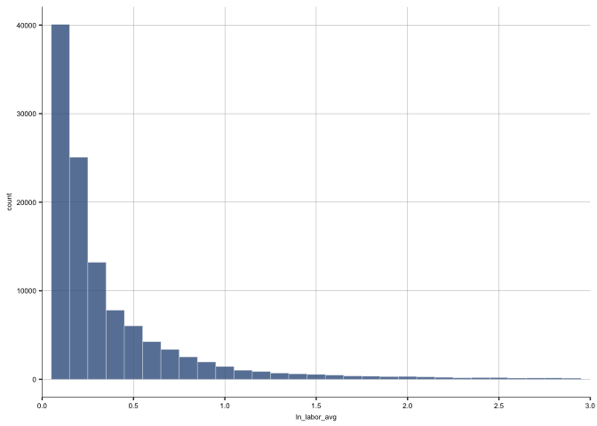

# DATA PREPARATION

## Import data
I import dataset cs_bisnode_panel.csv which provides information on Scandinavian owned companies. I drop those variables with too many missing values and I retain only firm-year observations between 2010 and 2015.


```r
data <- read_csv(paste(data_in,"cs_bisnode_panel.csv", sep = "/"))
```

```
## Rows: 287829 Columns: 48
## ── Column specification ────────────────────────────────────────────────────────
## Delimiter: ","
## chr   (3): gender, origin, region_m
## dbl  (40): comp_id, COGS, amort, curr_assets, curr_liab, extra_exp, extra_in...
## lgl   (1): D
## date  (4): begin, end, founded_date, exit_date
## 
## ℹ Use `spec()` to retrieve the full column specification for this data.
## ℹ Specify the column types or set `show_col_types = FALSE` to quiet this message.
```

```r
# drop variables with many NAs
data <- data %>%
  select(-c(COGS, finished_prod, net_dom_sales, net_exp_sales, wages)) %>%
  filter(year !=2016)

#panel to use
data <- data %>%
  filter(year >= 2010,
         year <= 2015)
```

## Label engineering
I add the missing year and company id combinations; I also identify the companies that are "alive", i.e. sales greater than 0 and no missing value for sales 


```r
# add all missing year and comp_id combinations -
# originally missing combinations will have NAs in all other columns
data <- data %>%
  complete(year, comp_id)

# generate status_alive; if sales larger than zero and not-NA, then firm is alive
data  <- data %>%
  mutate(status_alive = sales > 0 & !is.na(sales) %>%
           as.numeric(.))
```

## Constructing the Target
### Employment
Ideally, to identify fast-growing firms, I would use employment: firms (with at least 5 or 10 employees, i.e. not too small) would be identified as fast-growing if their employment annualized growing rate were greater than a certain threshold (e.g. 20%). However, the variable for employment, labor_avg, expresses the monthly average employment in one year. I could look at other possible measures of growth, for example sales, but I believe fast growth of employment can better define fast-growing firms: sales could grow for one or two years just due to contingencies and non-structural growth; while, when a firm hires more employees, the expansion entails a more structural/intrinsic growth. 
Moreover, the variables labor_avg is noisy (there are 121990 NA values out of 236250 total observations, and 316 0 values) but also sales is almost as noisy (72386 NA and 28864 zeros), and the lost in observations is almost the same. Therefore, I choose to proceed with employment.

First, I remove the missing values from labor_avg and I drop observations where labor_avg==0.
Then, I look at the distribution (log does not change)


```r
Hmisc::describe(data$labor_avg)
```

```
## data$labor_avg 
##        n  missing distinct     Info     Mean      Gmd      .05      .10 
##   114260   121990     4974    0.985   0.9694    1.505  0.08333  0.08333 
##      .25      .50      .75      .90      .95 
##  0.09028  0.23485  0.54861  1.35417  2.75000 
## 
## lowest : 0.000000e+00 6.944444e-03 1.515152e-02 2.083333e-02 2.272727e-02
## highest: 1.900000e+02 1.900682e+02 1.909306e+02 2.021061e+02 2.086771e+02
```

```r
#table(data$labor_avg)
Hmisc::describe(data$sales)
```

```
## data$sales 
##        n  missing distinct     Info     Mean      Gmd      .05      .10 
##   163864    72386    60270    0.995   466206   864456        0        0 
##      .25      .50      .75      .90      .95 
##     3093    26970   106062   370447   927824 
## 
## lowest :   -255388.89    -92325.93    -81492.59    -72951.85    -60725.93
## highest: 109593096.00 109951000.00 110601104.00 110745808.00 111029448.00
```

```r
#table(data$sales)

# drop missing
data <- data %>%
  filter(!is.na(labor_avg))

# drop those that are 0
data <- data %>%
  filter(labor_avg>0.0069)


labor_avg_graph <- ggplot(data, aes(x=labor_avg)) +
  geom_histogram(binwidth = 0.1, fill = color[1], color = color.outline, alpha = 0.8, size = 0.1) +
  ylab("count") +
  xlab("labor_avg") +
  scale_x_continuous(expand = c(0.00,0.00),limits=c(0,5), breaks = seq(0,5, 0.5)) +
  theme_bg()
```

```
## Warning: Using `size` aesthetic for lines was deprecated in ggplot2 3.4.0.
## ℹ Please use `linewidth` instead.
```

```
## Warning: The `size` argument of `element_rect()` is deprecated as of ggplot2 3.4.0.
## ℹ Please use the `linewidth` argument instead.
```

```
## Warning: The `size` argument of `element_line()` is deprecated as of ggplot2 3.4.0.
## ℹ Please use the `linewidth` argument instead.
```

```r
labor_avg_graph
```

```
## Warning: Removed 3371 rows containing non-finite values (`stat_bin()`).
```

```
## Warning: Removed 2 rows containing missing values (`geom_bar()`).
```

<!-- -->

```r
#ln
data <- data %>%
  mutate(ln_labor_avg = log(labor_avg+1))

Hmisc::describe(data$ln_labor_avg)
```

```
## data$ln_labor_avg 
##        n  missing distinct     Info     Mean      Gmd      .05      .10 
##   113944        0     4973    0.985   0.3847   0.4149  0.08004  0.08004 
##      .25      .50      .75      .90      .95 
##  0.08701  0.21197  0.43736  0.85619  1.32453 
## 
## lowest : 0.006920443 0.015037878 0.020619288 0.022472857 0.027398974
## highest: 5.252273428 5.252630308 5.257133626 5.313728325 5.345568625
```

```r
ln_labor_avg_graph <- ggplot(data, aes(x=ln_labor_avg)) +
  geom_histogram(binwidth = 0.1, fill = color[1], color = color.outline, alpha = 0.8, size = 0.1) +
  ylab("count") +
  xlab("ln_labor_avg") +
  scale_x_continuous(expand = c(0.00,0.00),limits=c(0,3), breaks = seq(0,3, 0.5)) +
  theme_bg()
ln_labor_avg_graph
```

```
## Warning: Removed 847 rows containing non-finite values (`stat_bin()`).
## Removed 2 rows containing missing values (`geom_bar()`).
```

<!-- -->

#### Target variable
I construct the annual growth rate variable for the labor_avg. I look at quantiles and I consider as fast growing those firms with growth above the 75th percentile in the next year (fast_growth is the target variable and it is per year).


```r
#define target

# generate annual employment growth rate
data <- data %>% 
  group_by(comp_id) %>%
  mutate(growth_labor = (labor_avg - Lag(labor_avg, 1))/Lag(labor_avg, 1)) %>%
  ungroup()

Hmisc::describe(data$growth_labor)
```

```
## data$growth_labor 
##        n  missing distinct     Info     Mean      Gmd      .05      .10 
##    83346    30598    28037    0.984  0.09416   0.4328 -0.44257 -0.30262 
##      .25      .50      .75      .90      .95 
## -0.09091  0.00000  0.11765  0.42105  0.75000 
## 
## lowest :  -0.9997797  -0.9980755  -0.9854015  -0.9849624  -0.9833333
## highest:  39.9499976  44.8181797  65.0833339  72.9999959 766.6999588
##                                                     
## Value          0    10    20    30    40    70   770
## Frequency  83137   168    31     3     4     2     1
## Proportion 0.997 0.002 0.000 0.000 0.000 0.000 0.000
## 
## For the frequency table, variable is rounded to the nearest 10
```

```r
growth_labor_75th <- quantile(data$growth_labor, 0.75, na.rm=TRUE)
growth_labor_75th 
```

```
##      75% 
## 0.117647
```

```r
#target
#fast growth in one year = growth above 75th in next year
data <- data %>%
  group_by(comp_id) %>%
  mutate(fast_growth = ifelse(lead(growth_labor,1) > growth_labor_75th, 1, 0))
#above the 75th percentile
Hmisc::describe(data$fast_growth)
```

```
## data$fast_growth 
##        n  missing distinct     Info      Sum     Mean      Gmd 
##    83346    30598        2    0.562    20836     0.25    0.375
```

## Sales
First, I remove negative sales, create the logarithm of sales, re-scaled dividing by 1m, and growth rate. 
Then, I replace with 0 sales of new firms.


```r
summary(data$sales) # There will be NAs, we'll drop them soon
```

```
##      Min.   1st Qu.    Median      Mean   3rd Qu.      Max.      NA's 
##   -255389     18344     55315    662170    173867 111029448       923
```

```r
data <- data %>%
  mutate(sales = ifelse(sales < 0, 1, sales),
         ln_sales = ifelse(sales > 0, log(sales), 0),
         sales_mil=sales/1000000,
         sales_mil_log = ifelse(sales > 0, log(sales_mil), 0))
#growth rate of sales
data <- data %>%
  group_by(comp_id) %>%
  mutate(d1_sales_mil_log = sales_mil_log - Lag(sales_mil_log, 1) ) %>%
  ungroup()


# replace w 0 for new firms + add dummy to capture it
data <- data %>%
  mutate(age = (year - founded_year) %>%
           ifelse(. < 0, 0, .),
         new = as.numeric(age <= 1) %>% #  (age could be 0,1 )
           ifelse(balsheet_notfullyear == 1, 1, .),
         d1_sales_mil_log = ifelse(new == 1, 0, d1_sales_mil_log),
         new = ifelse(is.na(d1_sales_mil_log), 1, new),
         d1_sales_mil_log = ifelse(is.na(d1_sales_mil_log), 0, d1_sales_mil_log))
```

## Cross section
I retain observations for 2012 for firms that are alive, and that have sales between 1000 (seem non-operational) and 10m euros, hence focusing on SME sector. Moreover, I remove those firms that have missing values for fast_growth.


```r
# look at cross section
data <- data %>%
  filter((year==2012) & (status_alive==1))%>%
  # look at firms below 10m euro revenues and above 1000 euros
  filter(!(sales_mil > 10)) %>%
  filter(!(sales_mil < 0.001))


Hmisc::describe(data$fast_growth)
```

```
## data$fast_growth 
##        n  missing distinct     Info      Sum     Mean      Gmd 
##    15450     3119        2    0.556     3794   0.2456   0.3706
```

```r
data <- data %>%
  filter(!is.na(fast_growth))
```

## Feature engineering 
The  variables can be divided into 4 groups: size, management, financial variables, and other characteristics.

### Industry and Firms' characteristics
I change some industry category codes and define some additional firm characteristics: squared age, foreign management, gender of the CEO, firm HQ location.


```r
# change some industry category codes
data <- data %>%
  mutate(ind2_cat = ind2 %>%
           ifelse(. > 56, 60, .)  %>%
           ifelse(. < 26, 20, .) %>%
           ifelse(. < 55 & . > 35, 40, .) %>%
           ifelse(. == 31, 30, .) %>%
           ifelse(is.na(.), 99, .)
           )

table(data$ind2_cat)
```

```
## 
##   20   26   27   28   29   30   32   33   40   55   56   60 
##   40  716  479 1461  227  125  102 1253  150 1541 9212  144
```

```r
# Firm characteristics
data <- data %>%
  mutate(age2 = age^2,
         foreign_management = as.numeric(foreign >= 0.5),
         gender_m = factor(gender, levels = c("female", "male", "mix")),
         m_region_loc = factor(region_m, levels = c("Central", "East", "West")))
```


### Financial variables
I look at financial variables: negative values of assets are changed to 0 (because they cannot be negative); I create total_asset variable which includes intangible, current, and fixed assets; I also create ratios for these financial variables, to be able to find extreme values. 
Moreover, I create flags (for errors) and winsorizing tails. The latter are used to capture extreme values. Finally, I add also quadratic terms to capture non-linearities and a flag for 0 values, which could signal very low activity.


```r
# assets can't be negative. Change them to 0 and add a flag.
data <-data  %>%
  mutate(flag_asset_problem=ifelse(intang_assets<0 | curr_assets<0 | fixed_assets<0,1,0  ))
table(data$flag_asset_problem)
```

```
## 
##     0     1 
## 15440     5
```

```r
data <- data %>%
  mutate(intang_assets = ifelse(intang_assets < 0, 0, intang_assets),
         curr_assets = ifelse(curr_assets < 0, 0, curr_assets),
         fixed_assets = ifelse(fixed_assets < 0, 0, fixed_assets))

# generate total assets
data <- data %>%
  mutate(total_assets_bs = intang_assets + curr_assets + fixed_assets)
summary(data$total_assets_bs)
```

```
##     Min.  1st Qu.   Median     Mean  3rd Qu.     Max.     NA's 
##        0     9237    33722   312084   136500 50967259        5
```

```r
pl_names <- c("extra_exp","extra_inc",  "extra_profit_loss", "inc_bef_tax" ,"inventories",
              "material_exp", "profit_loss_year", "personnel_exp")
bs_names <- c("intang_assets", "curr_liab", "fixed_assets", "liq_assets", "curr_assets",
              "share_eq", "subscribed_cap", "tang_assets" )

# divide all pl_names elements by sales and create new column for it
data <- data %>%
  mutate_at(vars(pl_names), funs("pl"=./sales))

# divide all bs_names elements by total_assets_bs and create new column for it
data <- data %>%
  mutate_at(vars(bs_names), funs("bs"=ifelse(total_assets_bs == 0, 0, ./total_assets_bs)))


# Flags and winsorizing tails

# Variables that represent accounting items that cannot be negative (e.g. materials)
zero <-  c("extra_exp_pl", "extra_inc_pl", "inventories_pl", "material_exp_pl", "personnel_exp_pl",
           "curr_liab_bs", "fixed_assets_bs", "liq_assets_bs", "curr_assets_bs", "subscribed_cap_bs",
           "intang_assets_bs")

data <- data %>%
  mutate_at(vars(zero), funs("flag_high"= as.numeric(.> 1))) %>%
  mutate_at(vars(zero), funs(ifelse(.> 1, 1, .))) %>%
  mutate_at(vars(zero), funs("flag_error"= as.numeric(.< 0))) %>%
  mutate_at(vars(zero), funs(ifelse(.< 0, 0, .)))


# for vars that could be any, but are mostly between -1 and 1
any <-  c("extra_profit_loss_pl", "inc_bef_tax_pl", "profit_loss_year_pl", "share_eq_bs")

data <- data %>%
  mutate_at(vars(any), funs("flag_low"= as.numeric(.< -1))) %>%
  mutate_at(vars(any), funs(ifelse(.< -1, -1, .))) %>%
  mutate_at(vars(any), funs("flag_high"= as.numeric(.> 1))) %>%
  mutate_at(vars(any), funs(ifelse(.> 1, 1, .))) %>%
  mutate_at(vars(any), funs("flag_zero"= as.numeric(.== 0))) %>%
  mutate_at(vars(any), funs("quad"= .^2))


# dropping flags with no variation
variances<- data %>%
  select(contains("flag")) %>%
  apply(2, var, na.rm = TRUE) == 0

data <- data %>%
  select(-one_of(names(variances)[variances]))
```

### Additional characteristics
From CEOs ages, I can categorize them into young, old (or missing), and create a dummy for young CEOs. Furthermore, I create factors for urban and industry category.


```r
# CEO age
data <- data %>%
  mutate(ceo_age = year-birth_year,
         flag_low_ceo_age = as.numeric(ceo_age < 25 & !is.na(ceo_age)),
         flag_high_ceo_age = as.numeric(ceo_age > 75 & !is.na(ceo_age)),
         flag_miss_ceo_age = as.numeric(is.na(ceo_age)))

data <- data %>%
  mutate(ceo_age = ifelse(ceo_age < 25, 25, ceo_age) %>%
           ifelse(. > 75, 75, .) %>%
           ifelse(is.na(.), mean(., na.rm = TRUE), .),
         ceo_young = as.numeric(ceo_age < 40))

# create factors
data <- data %>%
  mutate(urban_m = factor(urban_m, levels = c(1,2,3)),
         ind2_cat = factor(ind2_cat, levels = sort(unique(data$ind2_cat))))
```

### Factor target
I create a factor for the target variable fast_growth: there are 11656 non-fast-growing firms and 3794 fast-growing


```r
data <- data %>%
  mutate(fast_growth_f = factor(fast_growth, levels = c(0,1)) %>%
           recode(., `0` = 'no_fast_growth', `1` = "fast_growth"))

table(data$fast_growth_f)
```

```
## 
## no_fast_growth    fast_growth 
##          11656           3794
```

## Graphical analysis
### Sales


```r
# Sales
data <- data %>%
  mutate(sales_mil_log_sq=sales_mil_log^2)

graph_1 <- ggplot(data = data, aes(x=sales_mil_log, y=as.numeric(fast_growth))) +
  geom_point(size=2,  shape=20, stroke=2, fill="blue", color="blue") +
  geom_smooth(method = "lm", formula = y ~ poly(x,2), color=color[4], se = F, size=1)+
  geom_smooth(method="loess", se=F, colour=color[5], size=1.5, span=0.9) +
  labs(x = "sales_mil_log",y = "fast_growth") +
  theme_bg()
graph_1
```

```
## `geom_smooth()` using formula = 'y ~ x'
```

<!-- -->

```r
save_fig("graph_1", output, "small")
```

```
## `geom_smooth()` using formula = 'y ~ x'
## `geom_smooth()` using formula = 'y ~ x'
```

```
## quartz_off_screen 
##                 2
```

```r
ols_s <- lm(fast_growth~sales_mil_log+sales_mil_log_sq,
                data = data)
summary(ols_s)
```

```
## 
## Call:
## lm(formula = fast_growth ~ sales_mil_log + sales_mil_log_sq, 
##     data = data)
## 
## Residuals:
##     Min      1Q  Median      3Q     Max 
## -0.2525 -0.2512 -0.2460 -0.2021  0.8043 
## 
## Coefficients:
##                    Estimate Std. Error t value Pr(>|t|)    
## (Intercept)       0.2382353  0.0072563  32.831  < 2e-16 ***
## sales_mil_log    -0.0123897  0.0049572  -2.499  0.01245 *  
## sales_mil_log_sq -0.0026823  0.0009483  -2.828  0.00468 ** 
## ---
## Signif. codes:  0 '***' 0.001 '**' 0.01 '*' 0.05 '.' 0.1 ' ' 1
## 
## Residual standard error: 0.4304 on 15447 degrees of freedom
## Multiple R-squared:  0.0005181,	Adjusted R-squared:  0.0003887 
## F-statistic: 4.004 on 2 and 15447 DF,  p-value: 0.01827
```

```r
# Sales change
# lowess
Hmisc::describe(data$d1_sales_mil_log) # no missing
```

```
## data$d1_sales_mil_log 
##        n  missing distinct     Info     Mean      Gmd      .05      .10 
##    15450        0    11616    0.985 -0.01616    0.465  -0.6949  -0.4049 
##      .25      .50      .75      .90      .95 
##  -0.1151   0.0000   0.1127   0.3759   0.6291 
## 
## lowest : -6.651105 -6.606280 -6.547753 -6.465923 -6.385880
## highest:  5.472847  5.474876  5.567004  5.930562  9.587817
```

```r
graph_2<-ggplot(data = data, aes(x=d1_sales_mil_log, y=as.numeric(fast_growth))) +
  geom_point(size=0.1,  shape=20, stroke=2, fill=color[2], color=color[2]) +
  geom_smooth(method="loess", se=F, colour=color[1], size=1.5, span=0.9) +
 labs(x = "Growth rate (Diff of ln sales)",y = "fast_growth") +
 theme_bg() +
 scale_x_continuous(limits = c(-7,10), breaks = seq(-7,10, 5))
graph_2
```

```
## `geom_smooth()` using formula = 'y ~ x'
```

<!-- -->

```r
save_fig("graph_2", output, "small")
```

```
## `geom_smooth()` using formula = 'y ~ x'
## `geom_smooth()` using formula = 'y ~ x'
```

```
## quartz_off_screen 
##                 2
```

```r
# Winsorization
# generate variables
Hmisc::describe(data$d1_sales_mil_log)
```

```
## data$d1_sales_mil_log 
##        n  missing distinct     Info     Mean      Gmd      .05      .10 
##    15450        0    11616    0.985 -0.01616    0.465  -0.6949  -0.4049 
##      .25      .50      .75      .90      .95 
##  -0.1151   0.0000   0.1127   0.3759   0.6291 
## 
## lowest : -6.651105 -6.606280 -6.547753 -6.465923 -6.385880
## highest:  5.472847  5.474876  5.567004  5.930562  9.587817
```

```r
#very few firms outside -1,1 range
data <- data %>%
  mutate(flag_low_d1_sales_mil_log = ifelse(d1_sales_mil_log < -1, 1, 0),
         flag_high_d1_sales_mil_log = ifelse(d1_sales_mil_log > 1, 1, 0),
         d1_sales_mil_log_mod = ifelse(d1_sales_mil_log < -1, -1,
                                       ifelse(d1_sales_mil_log > 1, 1, d1_sales_mil_log)),
         d1_sales_mil_log_mod_sq = d1_sales_mil_log_mod^2
         )

# no more imputation, drop obs if key vars missing
data <- data %>%
  filter(!is.na(liq_assets_bs),!is.na(foreign), !is.na(ind))

# drop missing
data <- data %>%
  filter(!is.na(age),!is.na(foreign), !is.na(material_exp_pl), !is.na(m_region_loc))
Hmisc::describe(data$age)
```

```
## data$age 
##        n  missing distinct     Info     Mean      Gmd      .05      .10 
##    13758        0       30    0.996    9.047    7.874        1        1 
##      .25      .50      .75      .90      .95 
##        3        8       15       20       21 
## 
## lowest :  0  1  2  3  4, highest: 25 26 28 29 34
```

```r
# drop unused factor levels
data <- data %>%
  mutate_at(vars(colnames(data)[sapply(data, is.factor)]), funs(fct_drop))

Hmisc::describe(data$d1_sales_mil_log_mod)
```

```
## data$d1_sales_mil_log_mod 
##         n   missing  distinct      Info      Mean       Gmd       .05       .10 
##     13758         0     10427     0.994 -0.006452    0.3844   -0.7293   -0.4347 
##       .25       .50       .75       .90       .95 
##   -0.1373    0.0000    0.1333    0.3999    0.6550 
## 
## lowest : -1.0000000 -0.9996281 -0.9973432 -0.9946901 -0.9942466
## highest:  0.9964886  0.9968737  0.9983609  0.9993198  1.0000000
```

```r
graph_3<-ggplot(data = data, aes(x=d1_sales_mil_log_mod, y=as.numeric(fast_growth))) +
  geom_point(size=0.1,  shape=20, stroke=2, fill=color[2], color=color[2]) +
  geom_smooth(method="loess", se=F, colour=color[1], size=1.5, span=0.9) +
  labs(x = "Growth rate (Diff of ln sales)",y = "fast_growth") +
  theme_bg() +
  scale_x_continuous(limits = c(-1,1), breaks = seq(-1,1, 0.5))
graph_3
```

```
## `geom_smooth()` using formula = 'y ~ x'
```

<!-- -->

```r
save_fig("graph_3", output, "small")
```

```
## `geom_smooth()` using formula = 'y ~ x'
## `geom_smooth()` using formula = 'y ~ x'
```

```
## quartz_off_screen 
##                 2
```

```r
graph_4<-ggplot(data = data, aes(x=d1_sales_mil_log, y=d1_sales_mil_log_mod)) +
  geom_point(size=0.1,  shape=20, stroke=2, fill=color[2], color=color[2]) +
  labs(x = "Growth rate (Diff of ln sales) (original)",y = "Growth rate (Diff of ln sales) (winsorized)") +
  theme_bg() +
  scale_x_continuous(limits = c(-7,10), breaks = seq(-7,10, 1)) +
scale_y_continuous(limits = c(-3,3), breaks = seq(-3,3, 1))
graph_4
```

<!-- -->

```r
save_fig("graph_4", output, "small")
```

```
## quartz_off_screen 
##                 2
```

## Save data
Number of observations: 13758

```r
#datasummary_skim(data, type="numeric")

table(data$fast_growth_f)
```

```
## 
## no_fast_growth    fast_growth 
##          10391           3367
```

```r
write_csv(data,paste0(data_out,"bisnode_firms_clean.csv"))
write_rds(data,paste0(data_out,"bisnode_firms_clean.rds"))
```

